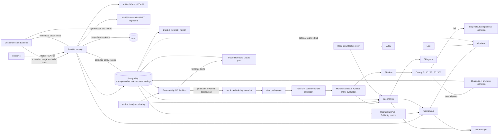
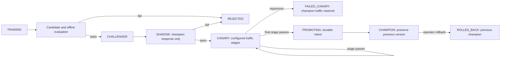

# System architecture

## Product boundary - current implementation

Company backend -> batch /v1/checks -> identity + capture inspectors -> immutable PostgreSQL check/event/outbox -> signed company webhook. MinIO retains suspicious evidence. Tenant portal manages employees/keys/webhooks/history/PDF/CSV; company owns exams and admission. Existing hosted-session/manual-review sequence below is compatibility only. Airflow orchestrates model lifecycle; API/web are runtime services. Grafana/Evidently/Telegram are platform operations.

## Responsibilities and flows

The primary product is a customer-scheduled batch integrity API and company portal. Hosted verification remains a compatibility example. Local Compose emulates separate PaaS services; a customer can run the same installation privately. `TenantKey` stores only hashed random credentials. All customer reads/writes scope people/events/sessions/audit to the authenticated tenant. Platform keys manage tenants and ML operations; integration keys cannot enroll biometrics, alter review labels or bypass the hosted session.

### Primary company batch lifecycle

Registration creates an active simulated subscription and one-time operator key. The operator enrolls employees and configures integration keys/webhooks. Employee identifiers have a tenant namespace. The customer backend authenticates the employee in its own system, chooses capture timing and supplies employee/session/request IDs plus consent and image/WAV files. No exam score or business decision enters this contract.

The serving plane runs identity comparison, face count, PAD, audio anti-spoof and consecutive speaker consistency. It classifies each check as verified, suspicious or inconclusive and preserves detector/model limits in the response. Idempotency fingerprints employee/session/media: identical retries return one result; changed content returns 409. Exact media reuse on a different request in the same employee/session is a separate suspicious signal.

Check metadata, identity event, evidence metadata and callback outbox commit together in PostgreSQL. Suspicious media is written to tenant/check-scoped MinIO objects before commit; storage failure is explicit as partial/unavailable without losing the result. Ordinary media and raw enrollment are discarded by default. Media object writes are not part of the PostgreSQL transaction; a database failure after upload can leave orphaned objects, so a production retention job must reconcile them. API results and callback payloads use the same immutable result. The company portal reads its own checks, named reasons, first/last check ranges, authenticated evidence and PDF/CSV exports.

### Hosted/session compatibility

Session creation binds tenant, person, exam, request ID and expiry. The browser carries only a one-session bearer token in a URL fragment, never a tenant API key. An atomic conditional update prevents reuse. Inference event, completed session and webhook outbox commit in one DB transaction. A worker claims pending deliveries with PostgreSQL row locks, signs raw JSON with timestamp/HMAC and retries independently. Delivery can be duplicated after worker crashes; the customer receiver must deduplicate and fetch canonical API state. Manual review increments sequence without rewriting model predictions.

The legacy example runs on its own port/process/database and grants exam admission only after checking the server-side session/person/exam/tenant binding and expiry. Cookie state survives return navigation; an exam attempt is consumed once. Its candidate selector is a mock login, not a deployable authentication system.

The compatibility identity plane validates media, extracts normalized embeddings, compares them with the declared identity, applies the versioned policy, records an immutable event and returns modality scores/reason codes. A separate feedback table holds human/synthetic evaluation labels so inference history is not rewritten. Company batch results do not contain manual admission decisions.

### Shared MLOps and monitoring

The encoders remain pretrained YuNet/SFace and ECAPA. Input is an image/WAV plus
the declared identity; the encoder produces a normalized embedding. Serving uses
maximum cosine similarity against that person's active template set, then an
independent Face or Voice threshold policy. Policy retraining calibrates thresholds,
not encoder weights. Both champion and challenger share the same encoder/score;
their decisions can differ, but their score delta is zero. Capture integrity
inspectors remain separate and authoritative.

The hourly `biometric_monitoring_pipeline` calls the lifecycle API to compare a
frozen reference with a current window. Face and Voice have independent evidence,
persistence counters, training claims, registered policies and rollout states.
The existing 60-second `drift-monitor` continues PSI/Evidently operational reporting;
it does not independently trigger retraining. There is one automation decision path.

| Evidence | Actual method | Interpretation |
|---|---|---|
| Input quality | PSI with 10 reference quantile bins on available image/audio scalars | Capture/input drift; alone never requests retraining |
| Embeddings | Joint RBF MMD squared on normalized vectors, capped at 512 per window | Distribution shift, not one test per vector dimension |
| Verification scores | Genuine/impostor PSI, moments, quantiles, threshold margins and separation | Movement toward the acceptance boundary, using trusted labels |
| Performance | Reviewed FMR/FNMR, empirical EER and TAR at configured FAR | Insufficient labels remain insufficient evidence |
| Template age | Buckets through 30/90/180/365 days and older, cohort scores/error rates/quality | Old-template-only degradation suggests template update |

PSI is `sum((current_bin-reference_bin) * log(current_bin/reference_bin))`, with
probabilities clipped at `1e-6`. MMD squared is `mean(Krr)+mean(Kcc)-2*mean(Krc)`
for kernel `exp(-squared_distance/2)`. Encoder versions must match and identity-set
overlap must be at least 80%; this reduces but does not eliminate population bias.
Quality features include image brightness/contrast/blur/resolution and detector
confidence/face area where available; audio duration/RMS/clipping/silence/sample rate.
Unavailable SNR/pose/occlusion measurements are not invented.

The decision engine returns HEALTHY, MONITOR, INPUT_DRIFT, EMBEDDING_DRIFT,
SCORE_DRIFT, TEMPLATE_UPDATE_REQUIRED, RETRAIN_REQUIRED or INSUFFICIENT_DATA.
Quality drift blocks automatic model retraining. Persistent embedding AND score
drift plus reviewed degradation across multiple age cohorts can request retraining;
old-template-only degradation with healthy recent templates follows the template path.
Only distinct new windows count toward persistence. Predictions never become labels.

Defaults in [pipeline/lifecycle_config.json](pipeline/lifecycle_config.json):
100 observations/window, 20 trusted labels/class for drift, PSI >0.2, MMD squared
>0.02, three qualifying windows, degradation at least 0.02 absolute and 25% relative
(absolute rule for zero baseline), 24-hour cooldown and 40 new reviewed observations.
Missing retained query embeddings or labels prevents full automatic decisions.
`RETAIN_MONITORING_EMBEDDINGS=false` is the default.

### Training, Registry and stateful policy deployment

Monitoring emits a deterministic per-modality training request. PostgreSQL row
locks prevent overlapping training for the same modality; retries reuse the intent.
`biometric_model_pipeline` has `schedule=None` and seven tasks: freeze snapshot,
validate, publish dataset, calibrate/register, RAI audit, offline gate, lifecycle tick.
Some task IDs retain legacy names such as `evaluate_and_promote_candidate` and
`reload_current_champion`; they now start/advance the guarded lifecycle rather than
immediately making a new candidate champion.

The training plane uses a fingerprinted snapshot; validation/calibration consume
the same rows. Identity-disjoint CV and a reserved holdout separate tuning from final
evaluation. MinIO stores versioned datasets/manifests; MLflow stores provenance,
parameters, metrics and artifacts. Candidate and current champion are evaluated on
the same holdout, with security regression blocking progression. Training scope is
currently tenant `demo`, not automatically every customer.

One production MLflow service holds `face-verification` and `voice-verification`,
each with its own `champion`, `challenger` and `previous_champion` aliases.
PostgreSQL `ModalityDeployment` and `LifecycleAudit` persist routing, thresholds,
stage timing, revision and evidence. MLflow is the model registry; these DB rows
coordinate serving and recoverable transitions, not a second registry.

Shadow records both policies while returning the champion result. Canary uses a
stable hash of modality/deployment/tenant/person/session for 5, 10, 25, 50 and 100%
traffic stages. Each stage requires at least 1,000 observations AND 3,600 seconds,
30 trusted labels/class, FMR <=0.01, FNMR <=0.05, no FMR increase, FNMR regression
<=0.005, policy p95 latency <=10 ms and disagreement <=0.1. Quality-cohort checks
block pooled results that hide regression. These are pilot settings, not measured
population safety guarantees. See [full lifecycle reference](docs/MODALITY_LIFECYCLE.md).

A failed stage sets challenger traffic to zero, preserves champion and stores metric,
value, limit, timestamp, stage and model version. Missing labels pause progression.
Label-dependent gates run on the hourly Airflow tick; they are not instantaneous.
Promotion persists PROMOTING before changing aliases, then switches DB champion;
retries reconcile interrupted operations. The previous model is tagged archived
and retained. Serving keeps the old champion until the DB switch commits.
The platform rollback endpoint coordinates DB and Registry state; manually editing
an alias alone is not the current rollback mechanism.

### Reversible template updates

Template aging follows a separate workflow. Candidate observations need explicit
trusted modality labels, distinct media hashes, valid integrity checks, high quality,
score margin, consistency and no conflicting identity evidence. Defaults require
10 creation observations, quality >=0.7, margin >=0.1 and consistency >=0.85.
The candidate adds a normalized centroid to the previous template set, bounded to
eight templates, while preserving original enrollment. A disjoint holdout needs
20 genuine and 20 impostor labels; FMR cannot rise or exceed 0.01 and FNMR cannot
worsen. Insufficient evidence stays PENDING_REVIEW.

Activation requires an idle model lifecycle and locks the person row, writes a
TemplateVersion and switches ActiveTemplate. Previous versions remain available
through the template rollback endpoint. Automatic post-activation template rollback
is not implemented; operator rollback is explicit.

### Storage and monitoring boundaries

PostgreSQL stores enrollment embeddings as JSON and versioned templates, observations,
labels, lifecycle state and audit. There is no vector database or pgvector index;
verification is 1:1, not a nearest-neighbor search over all employees. Query vector
retention is opt-in, normally 30 days; observation metadata defaults to 90 days.
MinIO monitoring exports contain scalar evidence and labels, not query vectors.
Enrollment and approved training snapshots have separate retention requirements.

Grafana provisions Prometheus, PostgreSQL, Loki and Alertmanager. The current
overview and simulation dashboards each contain ten Prometheus-only panels;
the other datasources remain available for Explore/investigation. Authenticated
HTML/JSON reports expose additional detail; see [monitoring mapping](MONITORING_MAPPING.md). Metrics expose aggregate modality drift, reviewed rates, rollout stage,
sample counts and rollbacks, not employee IDs or embedding vectors as labels.
Insufficient human labels yield waiting/insufficient status rather than healthy
performance. ops-monitor collects Registry, Airflow, RAI, readiness and Docker
resources. Production Alertmanager notifications go through ops-monitor to Telegram
when configured. Synthetic and human results are distinguished.

### Isolated classroom simulation

The platform-only three-button workflow has a separate `simulation-data` volume,
per-run SQLite lifecycle database, file-backed MLflow store and `simulation-lab`
network; `simulation-ui` publishes its MLflow browser on localhost:15031. It receives
no production database/MinIO credentials or biometric weight mounts. Airflow,
Prometheus, Alertmanager and the host are shared, so resource contention is possible.

`biometric_simulation` polls the queue each minute. Synthetic normalized vectors
and labels exercise the actual decision, calibration, offline gate, HTTP policy
routing and Registry reconciliation. Training waits for real Alertmanager delivery
to the simulation receiver; these alerts do not go to Telegram. One scenario passes
all canary stages; the other injects impostor failures at 25% and verifies rollback.
Reset cancels active work and restores simulation aliases/routing while retaining
audit. Simulation uses accelerated gates, not production acceptance thresholds.
See [SIMULATION.md](docs/SIMULATION.md). Legacy `pipeline/simulate_drift.py` instead
writes demo events through the main API and is not this isolated mechanism.

### Application deployment and initial state

GitHub Actions runs Ubuntu quality and Windows preflight, then container builds and
trusted-main deployment through a Linux WSL self-hosted runner bridged to Docker
Desktop. Exact-commit source is staged outside OneDrive; runtime secrets and volumes
are retained. This is single-host Docker Compose application replacement. Canary is
policy selection inside the API, not rolling application replicas or encoder images.

Fresh Compose startup is not proof of model readiness. `/health` can pass while
`/ready` returns 503 with an empty Registry. The lifecycle bootstrap migrates an
already registered incumbent and rejects `local-default`; initial evaluated champion
provisioning is not automated for a new installation. Restore authorized matching
DB/artifact backups for the established demo, or use isolated simulation for a
synthetic classroom lifecycle. See [README.md](README.md) and [DEPLOYMENT.md](DEPLOYMENT.md).

## Technology choices and trade-offs

| Choice | Why | Trade-off |
|---|---|---|
| FastAPI | typed OpenAPI, async uploads, simple validation | synchronous CPU inference limits throughput |
| PostgreSQL JSON embeddings | transparent 1:1 lookup, demo/audit and simple joins | query/index/storage sizing needs benchmarking; a vector DB is not inherently required for 1:1 verification |
| MLflow + MinIO | portable experiment/artifact/alias lifecycle | more services and credentials |
| Airflow LocalExecutor | visible retries/scheduling and course alignment | too heavy for a single small job; not horizontally scalable |
| Prometheus/Grafana/Evidently | system + ML monitoring with inspectable reports | Evidently batch report is not real-time stream processing |
| pretrained embeddings + calibrated policy | avoids pretending to train foundation models on tiny data | calibration quality depends on representative consented data |

## Failure and edge cases

Malformed multipart/media type/oversized uploads return 4xx. A batch with undecodable captures records inconclusive; identity/integrity suspicious signals still take precedence. Missing auxiliary weights produce unavailable capabilities rather than an all-clear. Invalid customer media does not imply a platform detector outage. Evidence failures preserve business results with explicit availability state. Duplicate enrollment is rejected; insufficient training pairs fail the DAG; failed model gates preserve the current champion; Registry reload failure returns 503 without dropping the loaded version; insufficient drift samples marks the monitor cycle failed/stale. Identity latency metrics describe the identity path; complete batch latency/capacity must be measured in a customer pilot.

The system-error handler attempts to stop active rollout immediately; if PostgreSQL
is unavailable it cannot durably update routing until recovery. In-flight responses
are not retroactively cancelled. Missing lifecycle evidence is INSUFFICIENT_DATA;
operational report failure/staleness is a separate monitoring concern. A target of
50,000 employees has not been load-tested. Synthetic tests and classroom rollout do
not establish real-user accuracy, fairness, liveness coverage or production readiness.
The DAG produces a Responsible AI report, but the modality candidate endpoint does
not enforce the legacy `REQUIRE_HUMAN_FAIRNESS` flag. A human fairness review remains
necessary; report generation is not proof of an automated fairness promotion gate.
