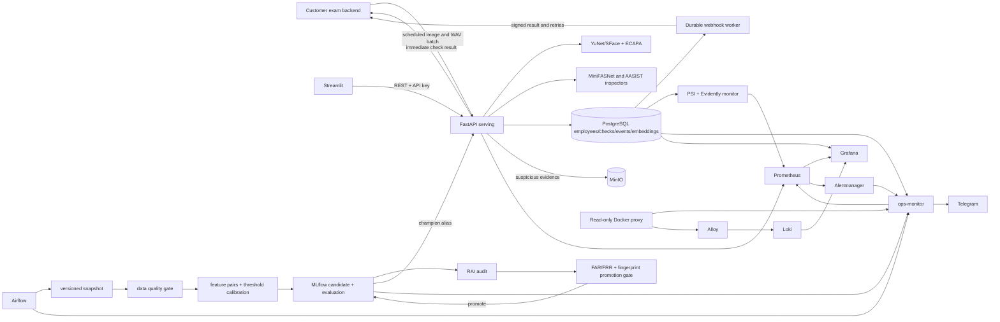

# System architecture

## Product boundary - 29/09 update

Company backend -> batch /v1/checks -> identity + capture inspectors -> immutable PostgreSQL check/event/outbox -> signed company webhook. MinIO retains suspicious evidence. Tenant portal manages employees/keys/webhooks/history/PDF/CSV; company owns exams and admission. Existing hosted-session/manual-review sequence below is compatibility only. Airflow orchestrates model lifecycle; API/web are runtime services. Grafana/Evidently/Telegram are platform operations.

## Responsibilities and flows

The primary product is a customer-scheduled batch integrity API and company portal. Hosted verification remains a compatibility example. Local Compose emulates separate PaaS services; a customer can run the same installation privately. `TenantKey` stores only hashed random credentials. All customer reads/writes scope people/events/sessions/audit to the authenticated tenant. Platform keys manage tenants and ML operations; integration keys cannot enroll biometrics, alter review labels or bypass the hosted session.

### Primary company batch lifecycle

Registration creates an active simulated subscription and one-time operator key. The operator enrolls employees and configures integration keys/webhooks. Employee identifiers have a tenant namespace. The customer backend authenticates the employee in its own system, chooses capture timing and supplies employee/session/request IDs plus consent and image/WAV files. No exam score or business decision enters this contract.

The serving plane runs identity comparison, face count, PAD, audio anti-spoof and consecutive speaker consistency. It classifies each check as verified, suspicious or inconclusive and preserves detector/model limits in the response. Idempotency fingerprints employee/session/media: identical retries return one result; changed content returns 409. Exact media reuse on a different request in the same employee/session is a separate suspicious signal.

Check metadata, identity event, evidence metadata and callback outbox commit together in PostgreSQL. Suspicious media is written to tenant/check-scoped MinIO objects before commit; storage failure is explicit as partial/unavailable without losing the result. Ordinary media and raw enrollment are discarded by default. Media object writes are not part of the PostgreSQL transaction; a database failure after upload can leave orphaned objects, so a production retention job must reconcile them. API results and callback payloads use the same immutable result. The company portal reads its own checks, named reasons, first/last check ranges, authenticated evidence and PDF/CSV exports.

### Hosted/session compatibility

Session creation binds tenant, person, exam, request ID and expiry. The browser carries only a one-session bearer token in a URL fragment, never a tenant API key. An atomic conditional update prevents reuse. Inference event, completed session and webhook outbox commit in one DB transaction. A worker claims pending deliveries with PostgreSQL row locks, signs raw JSON with timestamp/HMAC and retries independently. Delivery can be duplicated after worker crashes; the customer receiver must deduplicate and fetch canonical API state. Manual review increments sequence without rewriting model predictions.

The legacy example runs on its own port/process/database and grants exam admission only after checking the server-side session/person/exam/tenant binding and expiry. Cookie state survives return navigation; an exam attempt is consumed once. Its candidate selector is a mock login, not a deployable authentication system.

The compatibility identity plane validates media, extracts normalized embeddings, compares them with the declared identity, applies the versioned policy, records an immutable event and returns modality scores/reason codes. A separate feedback table holds human/synthetic evaluation labels so inference history is not rewritten. Company batch results do not contain manual admission decisions.

### Shared MLOps and monitoring

The training plane freezes exact feature rows in a fingerprinted snapshot per DAG run. Validation and calibration consume that same snapshot; retries reuse it. MLflow stores the fingerprint, snapshot, validation, thresholds and identity evaluation artifacts. Max-template scoring matches serving. Five identity partitions reserve one holdout outside all training/tuning; the remaining four form internal CV. Threshold selection minimizes worst FAR/FRR, then their average; a fixed candidate set chooses the smallest conservative margin meeting the internal CV budget. Holdout is used only for final evaluation. Promotion requires calibration, CV and holdout FAR/FRR <=20%, valid class counts and matching fingerprint after RAI audit. API startup loads the champion by pinned version; hot reload keeps the old runtime on failure. Identity-disjoint demo evaluation still does not prove accuracy on consented real users.

The monitoring plane compares the preceding and current production windows, calculates PSI independently, generates an Evidently report, exports ML and system metrics, visualizes them in Grafana and routes threshold breaches to Alertmanager. `pipeline/simulate_drift.py` exercises the API rather than writing directly to the database.

With `--with-feedback`, simulation creates explicit synthetic labels under reviewer `synthetic-simulation` to exercise performance degradation. Evidently compares two non-overlapping labelled windows and exports accuracy/precision/recall/F1/FAR/FRR separately for human and synthetic sources. Insufficient human labels produce waiting status and NaN metrics. Grafana combines Prometheus, PostgreSQL and Loki, with authenticated HTML/JSON reports at the same origin. ops-monitor collects Registry, Airflow, RAI, readiness and Docker resources; Alertmanager notifications are forwarded to Telegram with retries on transport failure.

## Technology choices and trade-offs

| Choice | Why | Trade-off |
|---|---|---|
| FastAPI | typed OpenAPI, async uploads, simple validation | synchronous CPU inference limits throughput |
| PostgreSQL JSON embeddings | transparent demo/audit and simple joins | pgvector/object features needed at scale |
| MLflow + MinIO | portable experiment/artifact/alias lifecycle | more services and credentials |
| Airflow LocalExecutor | visible retries/scheduling and course alignment | too heavy for a single small job; not horizontally scalable |
| Prometheus/Grafana/Evidently | system + ML monitoring with inspectable reports | Evidently batch report is not real-time stream processing |
| pretrained embeddings + calibrated policy | avoids pretending to train foundation models on tiny data | calibration quality depends on representative consented data |

## Failure and edge cases

Malformed multipart/media type/oversized uploads return 4xx. A batch with undecodable captures records inconclusive; identity/integrity suspicious signals still take precedence. Missing auxiliary weights produce unavailable capabilities rather than an all-clear. Invalid customer media does not imply a platform detector outage. Evidence failures preserve business results with explicit availability state. Duplicate enrollment is rejected; insufficient training pairs fail the DAG; failed model gates preserve the current champion; Registry reload failure returns 503 without dropping the loaded version; insufficient drift samples marks the monitor cycle failed/stale. Identity latency metrics describe the identity path; complete batch latency/capacity must be measured in a customer pilot.
