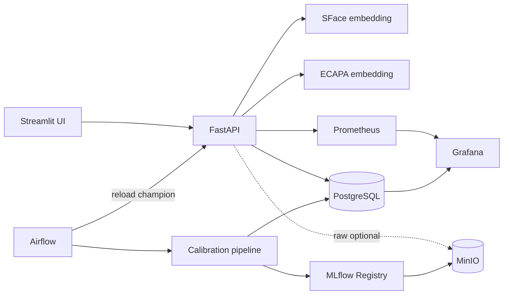

# DDM501 — Face + Voice Integrity MVP

Hệ thống demo nội bộ cho bài toán xác minh danh tính 1:1 trong kỳ thi tiếng Anh online. Project nối các phần đã học thành một luồng hoàn chỉnh: ingest/ghi danh → embedding → xác minh → Airflow → MLflow Registry → serving API → Prometheus/Grafana.

> Đây là MVP kỹ thuật. Quyết định `REVIEW` phải có người kiểm tra; không dùng một score đơn lẻ để tự động kết luận gian lận. Quality score không phải face PAD hay audio anti-spoof.

## Thành phần

| Thành phần | URL local | Mục đích |
|---|---:|---|
| Streamlit UI | http://localhost:18501 | Tạo hồ sơ, ghi danh, xác minh, xem event |
| FastAPI / docs | http://localhost:18100/docs | API 1:1 face + voice |
| MLflow | http://localhost:15030 | Experiment và Model Registry |
| Airflow | http://localhost:18081 | Pipeline snapshot/calibrate/register/reload |
| MinIO | http://localhost:19101 | Artifact store; raw biometric mặc định tắt |
| Prometheus | http://localhost:19090 | Metrics |
| Grafana | http://localhost:13000 | Dashboard và review queue |
| PostgreSQL | localhost:15433 | Metadata, enrollment, event |

Tài khoản demo Airflow/Grafana là `admin` / `admin`. API key mặc định là `demo-internal-key`. Chỉ các cổng loopback được publish; hãy đổi toàn bộ secret trước khi đặt lên mạng.

## Kiến trúc



## Chạy lần đầu

Yêu cầu Docker Desktop có tối thiểu khoảng 8 GB RAM và 10 GB trống. Image pretrained chứa PyTorch CPU nên lần build đầu có thể lâu.

```powershell
cd ddm501-face-voice-proctoring
Copy-Item .env.example .env
docker compose config --quiet
docker compose up -d --build
docker compose ps
```

`model-init` tải đúng revision đã pin của YuNet, SFace và SpeechBrain ECAPA từ Hugging Face vào `./models`. Chờ API healthy rồi mở UI:

```powershell
Invoke-RestMethod http://localhost:18100/health
Start-Process http://localhost:18501
```

Quy trình UI:

1. `Thêm hồ sơ`: tạo mã người dùng.
2. `Ghi danh sinh trắc`: thêm ít nhất 2 ảnh và 2 WAV. Nên dùng 3–5 mẫu mỗi loại.
3. `Xác minh`: khai báo danh tính, chụp ảnh và thu câu tiếng Anh mới.
4. Xem kết quả `ALLOW` hoặc `REVIEW`; event xuất hiện trong UI và Grafana.

## Dữ liệu demo 50–100 người

Bootstrap dùng:

- `marcelohaps/lfw` cho ảnh khuôn mặt;
- `mteb/speech-commands-mini` cho audio có `speaker_id`;
- mỗi face identity được ghép giả lập với một voice identity khác nguồn thành `DEMO-xxx`.

Vì ghép giả lập, bộ này chỉ kiểm thử pipeline và không được dùng để công bố FAR/FRR đa phương thức.

```powershell
python -m venv .venv
.\.venv\Scripts\Activate.ps1
pip install -r requirements-pipeline.txt
python pipeline\bootstrap_demo.py --identities 50 --samples 3
python pipeline\bootstrap_demo.py --enroll-existing
```

Có thể đổi `--identities 100`. Script pin immutable dataset SHA và sinh `data/bootstrap/manifest.json` để audit nguồn. `--enroll-existing` có thể chạy lại an toàn: hồ sơ đã ready sẽ được bỏ qua.

## Airflow và MLflow Registry

DAG `biometric_model_pipeline` chạy mỗi Chủ nhật:

1. snapshot số người/mẫu/event;
2. tạo genuine/impostor pairs theo từng modality;
3. chọn threshold giảm trung bình FAR và FRR;
4. log metrics + threshold bundle vào MLflow;
5. gán alias `candidate`; version đầu tiên tự thành `champion`;
6. yêu cầu API reload alias `champion`.

Chạy ngay ngoài lịch:

```powershell
docker compose exec airflow-scheduler airflow dags unpause biometric_model_pipeline
docker compose exec airflow-scheduler airflow dags trigger biometric_model_pipeline
```

Muốn promote candidate sau khi review metrics:

```powershell
docker compose exec airflow-scheduler python /opt/project/pipeline/calibrate_and_register.py --promote
Invoke-RestMethod -Method Post -Headers @{'X-API-Key'='demo-internal-key'} http://localhost:18100/v1/admin/reload-model
```

API luôn ghi `model_version` vào verification event để truy vết. Nếu MLflow không sẵn sàng, reload trả 503 và API tiếp tục giữ version đang chạy.

## API chính

- `POST /v1/people` — tạo hồ sơ.
- `GET /v1/people` — danh sách và trạng thái đủ mẫu.
- `POST /v1/people/{id}/enroll` — multipart `face_files` / `voice_files`.
- `POST /v1/verify` — multipart `person_id`, `session_id`, `face_file`, `voice_file`.
- `GET /v1/events` — audit/review queue.
- `POST /v1/admin/reload-model` — tải `models:/face-voice-risk-bundle@champion`.
- `GET /metrics/` — Prometheus exposition.

Các mutation/list event yêu cầu header `X-API-Key`.

## Hai chế độ model

- `MODEL_BACKEND=pretrained` (mặc định): YuNet + SFace và SpeechBrain ECAPA-TDNN trên CPU. Thiếu weights sẽ fail-closed.
- `MODEL_BACKEND=demo`: DCT ảnh + spectral descriptor audio, chỉ để unit/integration test nhanh. Không dùng score này cho người thật.

Đổi backend hoặc `.env` cần recreate container:

```powershell
docker compose up -d --force-recreate api
```

## Kiểm thử

```powershell
pip install -r requirements-api.txt pytest
pytest -q
python -m compileall api pipeline airflow/dags ui
docker compose config --quiet
```

## Những gì đã có và chưa có

Đã có: UI enrollment/verification, multi-sample templates, face/voice pretrained embedding, input quality gate, duplicate detection, Postgres audit, optional MinIO raw storage, MLflow aliases, Airflow orchestration, metrics và dashboard.

Chưa được gọi là hoàn thiện production:

- face PAD từ chuỗi video/challenge-response;
- audio replay/deepfake detector (AASIST hoặc model đã đánh giá trên dữ liệu nội bộ);
- ASR kiểm tra random phrase;
- encryption/KMS, SSO/RBAC, retention/deletion workflow;
- queue + autoscaling GPU, canary và load test ở 5.000 concurrent sessions;
- dữ liệu thu có chủ đích từ người dùng Việt Nam và threshold theo thiết bị/môi trường.

Các interface hiện tách embedding, quality, threshold bundle và event schema để thêm bốn model độc lập (`face_embedding`, `face_pad`, `speaker_embedding`, `audio_spoof`) mà không phá API/UI.

## Dừng hệ thống

```powershell
docker compose down
```

Không thêm `-v` nếu muốn giữ PostgreSQL, MinIO và Grafana data.
