# Kiến trúc tổng quan — DDM501 Face & Voice Integrity

Dự án hiện chạy bằng **Docker Compose trên một máy**, chưa dùng Kubernetes hoặc `node_exporter`. Hệ thống thi của công ty đứng ngoài **nền tảng MLOps DDM501**; bên trong nền tảng là serving, vòng đời model, monitoring/vận hành và CI/CD.

```mermaid
flowchart LR
    subgraph KH["Công ty khách hàng"]
        EXAM["Hệ thống thi<br/>chọn thời điểm gửi ảnh/WAV<br/>giữ điểm và quyết định nghiệp vụ"]
        ADMIN["Quản trị công ty"]
    end

    subgraph PLATFORM["Nền tảng MLOps DDM501 — Docker Compose"]
    subgraph DV["Serving — dịch vụ xác minh cho công ty"]
        PORTAL["Portal riêng từng công ty<br/>nhân viên, ghi danh, lịch sử<br/>bằng chứng, PDF/CSV"]
        API["FastAPI<br/>POST /v1/checks"]
        IDMODEL["Xác minh danh tính 1:1<br/>YuNet/SFace + ECAPA"]
        INTEGRITY["Tín hiệu integrity<br/>nhiều mặt, PAD, AASIST<br/>thay giọng, dùng lại media"]
        DB[("PostgreSQL<br/>tenant, embedding, check<br/>event, webhook outbox")]
        S3[("MinIO<br/>bằng chứng nghi vấn<br/>MLflow artifacts, data lake")]
        WEBHOOK["Webhook worker<br/>HMAC + retry"]
    end

    subgraph ML["Vòng đời model — Airflow và MLflow"]
        AIRFLOW["Training DAG<br/>hàng tuần / monitoring trigger"]
        SNAP["1. Snapshot có phiên bản<br/>fingerprint SHA-256"]
        DQ["2. Data quality gate<br/>kiểm tra mẫu và embedding"]
        LAKE["3. Dataset manifest + split<br/>MinIO SHA-256"]
        TRAIN["4. Feature pairs + calibration<br/>CV theo identity, holdout riêng"]
        CAND["MLflow candidate / challenger<br/>params, metrics, artifacts"]
        RAI["5. Responsible AI audit<br/>human/synthetic tách riêng"]
        GATE["6. Promotion gate<br/>paired holdout + reviewed shadow"]
        CHAMP["MLflow champion<br/>identity policy / thresholds"]
        KEEP["Không đạt gate<br/>giữ champion đang phục vụ"]
        RELOAD["7. Reload champion + health soak<br/>lỗi thì rollback alias/version"]
        MONDAG["Monitoring DAG hàng giờ<br/>ETL theo tenant/model"]
        WINDOWS["Reference + current snapshot<br/>input không nhãn / human labels"]
        DECIDE["PSI + FAR/FRR đủ mẫu<br/>2 cửa sổ drift / cooldown"]
    end

    subgraph OPS["Monitoring và vận hành"]
        DRIFT["drift-monitor<br/>PSI + Evidently<br/>human/synthetic feedback"]
        OPM["ops-monitor<br/>readiness, data quality<br/>Registry, DAG, RAI, Docker stats"]
        PROXY["Docker socket proxy<br/>chỉ đọc, POST=0"]
        ALLOY["Alloy"]
        LOKI["Loki<br/>container logs"]
        PROM["Prometheus<br/>pull /metrics + alert rules"]
        GRAFANA["Grafana<br/>dashboard trung tâm"]
        REPORTS["HTML/JSON reports<br/>Evidently + vận hành"]
        GATEWAY["Grafana gateway<br/>report cùng origin<br/>yêu cầu đăng nhập"]
        ALERT["Alertmanager"]
        TELEGRAM["Telegram<br/>cảnh báo kỹ thuật nền tảng"]
        OPERATOR["Đội vận hành<br/>xem xét cảnh báo và kết quả"]
    end

    subgraph CD["CI/CD — triển khai nền tảng"]
        CI["GitHub Actions + runner Windows<br/>quality → build → deploy"]
    end
    end

    ADMIN --> PORTAL --> API
    EXAM -->|"Ảnh + WAV theo batch do công ty chọn"| API
    API -->|"Kết quả check ngay"| EXAM
    API --> IDMODEL
    API --> INTEGRITY
    API --> DB
    API -->|"Chỉ media của check nghi vấn"| S3
    DB -->|"Kết quả đã commit"| WEBHOOK
    WEBHOOK -->|"Signed webhook"| EXAM

    DB -->|"Snapshot: mặc định tenant demo"| AIRFLOW
    AIRFLOW --> SNAP --> DQ --> LAKE --> TRAIN --> CAND --> RAI --> GATE
    LAKE --> S3
    DB -->|"Check + review đúng tenant"| MONDAG --> WINDOWS --> DECIDE
    WINDOWS --> S3
    DECIDE -->|"Đủ bằng chứng + tenant được phép train"| AIRFLOW
    DECIDE -->|"Trạng thái / khuyến nghị"| OPM
    CAND -->|"Ghi artifacts"| S3
    GATE -->|"Đạt"| CHAMP --> RELOAD --> API
    GATE -->|"Không đạt"| KEEP

    DB -->|"Event / feedback"| DRIFT
    DB -->|"Data quality"| OPM
    CHAMP -->|"Version / evaluation"| OPM
    AIRFLOW -->|"Task / DAG status"| OPM
    PROXY -->|"Container stats"| OPM
    PROXY -->|"Container logs"| ALLOY --> LOKI
    DRIFT --> REPORTS
    OPM --> REPORTS
    PROM -->|"Scrape /metrics"| API
    PROM -->|"Scrape /metrics"| WEBHOOK
    PROM -->|"Scrape /metrics"| DRIFT
    PROM -->|"Scrape /metrics"| OPM
    GRAFANA -->|"Truy vấn metric"| PROM
    GRAFANA -->|"SQL"| DB
    GRAFANA -->|"Truy vấn log"| LOKI
    GRAFANA --> GATEWAY
    REPORTS --> GATEWAY
    PROM -->|"Firing / resolved"| ALERT -->|"Webhook"| OPM --> TELEGRAM
    GRAFANA -->|"Theo dõi / điều tra"| OPERATOR
    TELEGRAM -->|"Cảnh báo để xử lý"| OPERATOR
    OPERATOR -.->|"Có thể chạy DAG thủ công"| AIRFLOW
    CI -->|"Triển khai stack"| DV
```

**Ranh giới nghiệp vụ:** công ty tự điều khiển lịch capture, bài thi, điểm và quyết định; DDM501 trả kết quả từng check ngay qua API và signed webhook. Portal chỉ hiển thị dữ liệu của công ty đó. Ảnh/audio của check thường không được lưu theo cấu hình mặc định; ảnh/audio nghi vấn được lưu làm bằng chứng trong MinIO.

**Vòng MLOps chung:** bảy bước đánh số là bảy task của DAG `biometric_model_pipeline`. DAG `biometric_monitoring_pipeline` tạo cửa sổ không nhãn, nhãn human tách riêng, tính drift và tự yêu cầu training khi đủ điều kiện. Training mặc định chỉ dùng tenant `demo`; dữ liệu các công ty khách hàng không tự đưa vào training. Candidate/challenger được so với champion trên cùng holdout và nhãn audit; thiếu bằng chứng hoặc không cải thiện thì giữ champion. Sau promotion, lỗi readiness sẽ rollback. Đây là shadow offline và kiểm tra sức khỏe serving, chưa có canary định tuyến traffic. Airflow hiệu chỉnh **identity policy**; MiniFASNet/AASIST là detector nghiên cứu có trọng số đã pin, chưa có benchmark anti-spoof trên dữ liệu khách hàng.

**Phản hồi vận hành:** Prometheus **chủ động kéo** metric từ API, webhook worker, drift-monitor và ops-monitor. Grafana truy vấn Prometheus, PostgreSQL và Loki; Alertmanager gửi sự kiện đến ops-monitor để chuyển cảnh báo kỹ thuật qua Telegram. Monitoring DAG có thể tự trigger training sau hai cửa sổ drift khác nhau hoặc hiệu năng human audit giảm, nhưng promotion luôn qua gate. Công ty không dùng Telegram này để nhận kết quả check. Docker stats đi qua proxy và ops-monitor; bản Compose hiện không có `node_exporter`.
