# Kiến trúc tổng quan — DDM501 Face & Voice Integrity

Dự án hiện chạy bằng **Docker Compose trên một máy**, chưa dùng Kubernetes hoặc `node_exporter`. Hệ thống thi của công ty đứng ngoài **nền tảng MLOps DDM501**; bên trong nền tảng là serving, vòng đời model, monitoring/vận hành và CI/CD.

```mermaid
flowchart LR
    subgraph KH["Công ty khách hàng"]
        EXAM["Hệ thống thi<br/>chọn thời điểm gửi ảnh/WAV<br/>giữ điểm và quyết định nghiệp vụ"]
        ADMIN["Quản trị công ty"]
    end

    subgraph PLATFORM["Nền tảng MLOps DDM501 — Docker Compose"]
    subgraph DV["Serving — dịch vụ xác minh cho công ty"]
        PORTAL["Portal riêng từng công ty<br/>nhân viên, ghi danh, lịch sử<br/>bằng chứng, PDF/CSV"]
        API["FastAPI<br/>POST /v1/checks"]
        IDMODEL["Xác minh danh tính 1:1<br/>YuNet/SFace + ECAPA"]
        INTEGRITY["Tín hiệu integrity<br/>nhiều mặt, PAD, AASIST<br/>thay giọng, dùng lại media"]
        DB[("PostgreSQL<br/>tenant, embedding, check<br/>event, webhook outbox")]
        S3[("MinIO<br/>bằng chứng nghi vấn<br/>MLflow artifacts, data lake")]
        WEBHOOK["Webhook worker<br/>HMAC + retry"]
    end

    subgraph ML["Vòng đời model — Airflow và MLflow"]
        AIRFLOW["Training DAG theo yêu cầu<br/>Face hoặc Voice riêng"]
        SNAP["1. Snapshot có phiên bản<br/>fingerprint SHA-256"]
        DQ["2. Data quality gate<br/>kiểm tra mẫu và embedding"]
        LAKE["3. Dataset manifest + split<br/>MinIO SHA-256"]
        TRAIN["4. Feature pairs + calibration<br/>CV theo identity, holdout riêng"]
        CAND["MLflow candidate / challenger<br/>params, metrics, artifacts"]
        RAI["5. Responsible AI audit<br/>human/synthetic tách riêng"]
        GATE["6. Offline gate<br/>cùng holdout với champion"]
        CHAMP["MLflow champion<br/>identity policy / thresholds"]
        KEEP["Không đạt gate<br/>giữ champion đang phục vụ"]
        TICK["7. Lifecycle tick<br/>state và audit trong PostgreSQL"]
        SHADOW["Shadow<br/>chỉ champion trả kết quả"]
        CANARY["Canary policy<br/>5 → 10 → 25 → 50 → 100%"]
        TEMPLATE["Template update gate<br/>trusted samples + holdout<br/>version và rollback"]
        MONDAG["Monitoring DAG hàng giờ<br/>ETL theo tenant/model"]
        WINDOWS["Reference + current snapshot<br/>input không nhãn / human labels"]
        DECIDE["Quality PSI + embedding MMD²<br/>score PSI + reviewed FMR/FNMR<br/>template aging + 3 cửa sổ"]
    end

    subgraph OPS["Monitoring và vận hành"]
        DRIFT["drift-monitor<br/>PSI + Evidently<br/>human/synthetic feedback"]
        OPM["ops-monitor<br/>readiness, data quality<br/>Registry, DAG, RAI, Docker stats"]
        PROXY["Docker socket proxy<br/>chỉ đọc, POST=0"]
        ALLOY["Alloy"]
        LOKI["Loki<br/>container logs"]
        PROM["Prometheus<br/>pull /metrics + alert rules"]
        GRAFANA["Grafana<br/>dashboard trung tâm"]
        REPORTS["HTML/JSON reports<br/>Evidently + vận hành"]
        GATEWAY["Grafana gateway<br/>report cùng origin<br/>yêu cầu đăng nhập"]
        ALERT["Alertmanager"]
        TELEGRAM["Telegram<br/>cảnh báo kỹ thuật nền tảng"]
        OPERATOR["Đội vận hành<br/>xem xét cảnh báo và kết quả"]
    end

    subgraph CD["CI/CD — triển khai nền tảng"]
        CI["Ubuntu quality + Windows preflight<br/>build → Linux WSL runner<br/>PowerShell → Docker Desktop"]
    end
    subgraph SIM["Simulation riêng — dữ liệu tổng hợp"]
        SIMUI["Platform: promote / rollback / reset"]
        SIMDAG["biometric_simulation<br/>poll queue mỗi phút"]
        SIMSERVICE["Simulation HTTP service<br/>SQLite + MLflow riêng<br/>simulation-data volume"]
        SIMALERT["Alertmanager simulation receiver<br/>không gửi Telegram"]
    end
    end

    ADMIN --> PORTAL --> API
    EXAM -->|"Ảnh + WAV theo batch do công ty chọn"| API
    API -->|"Kết quả check ngay"| EXAM
    API --> IDMODEL
    API --> INTEGRITY
    API --> DB
    API -->|"Chỉ media của check nghi vấn"| S3
    DB -->|"Kết quả đã commit"| WEBHOOK
    WEBHOOK -->|"Signed webhook"| EXAM

    DB -->|"Snapshot: mặc định tenant demo"| AIRFLOW
    AIRFLOW --> SNAP --> DQ --> LAKE --> TRAIN --> CAND --> RAI --> GATE
    LAKE --> S3
    DB -->|"Check + review đúng tenant"| MONDAG --> WINDOWS --> DECIDE
    WINDOWS --> S3
    DECIDE -->|"Đủ bằng chứng + tenant được phép train"| AIRFLOW
    DECIDE -->|"Trạng thái / khuyến nghị"| OPM
    CAND -->|"Ghi artifacts"| S3
    GATE -->|"Đạt: challenger"| TICK --> SHADOW -->|"Đạt gate"| CANARY
    CANARY -->|"Đạt stage cuối: PROMOTING"| CHAMP
    CHAMP -->|"DB champion + previous_champion"| DB
    DB -->|"Policy routing đã lưu"| API
    CANARY -->|"Regression: về champion"| KEEP
    SHADOW -->|"Không đạt"| KEEP
    DECIDE -->|"Chỉ template cũ suy giảm"| TEMPLATE --> DB
    GATE -->|"Không đạt"| KEEP
    SIMUI --> SIMDAG --> SIMSERVICE
    PROM -->|"Scrape simulation metrics"| SIMSERVICE
    ALERT -->|"Synthetic alert"| SIMALERT --> SIMSERVICE

    DB -->|"Event / feedback"| DRIFT
    DB -->|"Data quality"| OPM
    CHAMP -->|"Version / evaluation"| OPM
    AIRFLOW -->|"Task / DAG status"| OPM
    PROXY -->|"Container stats"| OPM
    PROXY -->|"Container logs"| ALLOY --> LOKI
    DRIFT --> REPORTS
    OPM --> REPORTS
    PROM -->|"Scrape /metrics"| API
    PROM -->|"Scrape /metrics"| WEBHOOK
    PROM -->|"Scrape /metrics"| DRIFT
    PROM -->|"Scrape /metrics"| OPM
    GRAFANA -->|"Truy vấn metric"| PROM
    GRAFANA -.->|"Explore SQL"| DB
    GRAFANA -.->|"Explore logs"| LOKI
    GRAFANA --> GATEWAY
    REPORTS --> GATEWAY
    PROM -->|"Firing / resolved"| ALERT -->|"Webhook"| OPM --> TELEGRAM
    GRAFANA -->|"Theo dõi / điều tra"| OPERATOR
    TELEGRAM -->|"Cảnh báo để xử lý"| OPERATOR
    OPERATOR -.->|"Điều tra evidence và lifecycle state"| DECIDE
    CI -->|"Triển khai stack"| DV
```

**Ranh giới nghiệp vụ:** công ty tự điều khiển lịch capture, bài thi, điểm và quyết định; DDM501 trả kết quả từng check ngay qua API và signed webhook. Portal chỉ hiển thị dữ liệu của công ty đó. Ảnh/audio của check thường không được lưu theo cấu hình mặc định; ảnh/audio nghi vấn được lưu làm bằng chứng trong MinIO.

**Vòng MLOps:** bảy bước đánh số là bảy task của DAG `biometric_model_pipeline`, không có lịch train hàng tuần. Monitoring hàng giờ yêu cầu train riêng Face/Voice khi embedding và score drift kéo dài, performance có nhãn tin cậy suy giảm qua nhiều nhóm tuổi template, đủ ba cửa sổ mới và cooldown/dữ liệu mới. Quality drift hoặc thiếu nhãn không tự kích hoạt train; template cũ suy giảm riêng đi theo template update. Training mặc định chỉ dùng tenant `demo`. Airflow hiệu chỉnh **ngưỡng**, không fine-tune SFace/ECAPA hoặc các detector PAD/AASIST.

**Triển khai policy:** offline so sánh trên cùng holdout; shadow trả kết quả champion; canary chọn policy thực bằng hash ổn định của cohort. Từng stage chờ đủ mẫu, thời gian và nhãn, kiểm tra FMR/FNMR, latency policy, disagreement và cohort chất lượng. Fail trả traffic về champion; pass stage cuối mới chuyển alias/DB champion và giữ phiên bản trước. Face/Voice có registry name, trạng thái và routing riêng. Đây là canary của threshold policy; deploy ứng dụng vẫn là thay container bằng Compose. Hai policy dùng chung embedding/score, không chạy hai encoder.

**Phản hồi vận hành:** Prometheus kéo metric từ API, worker, drift-monitor, ops-monitor và simulation. Hai dashboard overview/simulation đều có 10 panel dùng Prometheus. PostgreSQL/Loki vẫn được provision cho Explore/điều tra; report chi tiết nằm sau Grafana gateway. Production alerts đi qua ops-monitor tới Telegram nếu cấu hình; simulation alerts đi vào receiver riêng. Vòng Evidently 60 giây phục vụ báo cáo, không tạo trigger train thứ hai. Docker stats đi qua proxy và ops-monitor.

**Simulation:** ba nút dùng SQLite/MLflow/volume riêng, synthetic embeddings và nhãn, HTTP traffic và alert thật. Hai kịch bản minh họa promote hoặc fail tại canary 25%; reset phục hồi baseline demo và giữ audit. Host/Airflow dùng chung nên vẫn có thể tranh chấp tài nguyên. Không dùng kết quả này làm bằng chứng accuracy production.

**Giới hạn:** PostgreSQL lưu JSON embeddings cho so khớp 1:1, không có vector DB. Retain query embeddings tắt mặc định nên MMD có thể thiếu dữ liệu. Máy mới thiếu incumbent chưa tự khởi tạo champion thật; `/health` khác `/ready`. Mục tiêu 50.000 nhân viên chưa có load benchmark.

Xem [kiến trúc kỹ thuật](../ARCHITECTURE.md), [methods và thresholds](MODALITY_LIFECYCLE.md), [simulation](SIMULATION.md) và [setup](../README.md).
