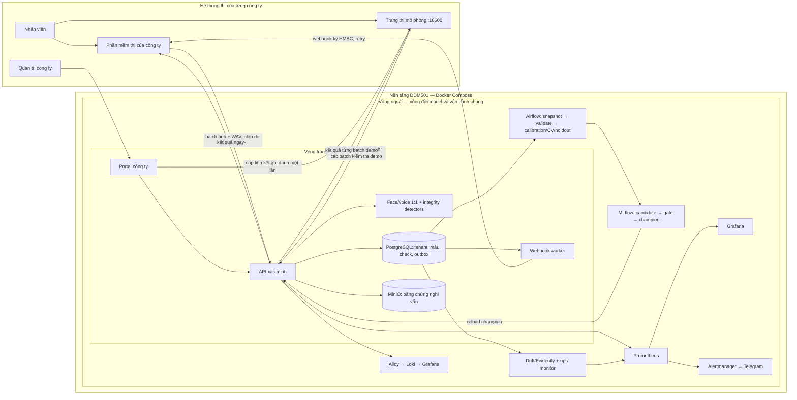

# Hướng dẫn demo và bàn giao toàn hệ thống DDM501 Face & Voice Integrity

> Dành cho đội tiếp quản, người trình bày và người vận hành. Tài liệu mô tả **bản MVP local chạy bằng Docker Compose**, đối chiếu với giao diện và mã nguồn ngày 02/10/2026. Dùng để kể câu chuyện, dẫn demo và giải nghĩa số liệu. Các giá trị trên dashboard thay đổi theo dữ liệu và khoảng thời gian chọn; không đọc các số trong tài liệu cũ như số đo hiện tại. Luồng monitoring/challenger mới được giải thích kỹ trong `docs/CONTINUOUS_MLOPS.md`.

## 1. Câu chuyện cần kể trong hai phút

Một công ty tổ chức kỳ đánh giá ngoại ngữ hằng năm. Công ty đã có phần mềm thi, biết nhân viên nào đang làm bài, tự chọn thời điểm chụp ảnh/thu âm, giữ điểm và đưa ra quyết định nghiệp vụ. Vấn đề là người khác có thể làm hộ, dùng khuôn mặt/giọng không khớp, dùng lại media hoặc đưa media giả. Công ty cần một **dịch vụ xác minh** có thể tích hợp qua API, trả tín hiệu ngay ở từng lần kiểm tra và giữ lịch sử/bằng chứng để quản trị xem lại.

DDM501 cung cấp dịch vụ đó cho nhiều công ty. Mỗi công ty có không gian dữ liệu, operator key, integration key và webhook riêng. Nhân viên được mời tự ghi danh **2 ảnh + 2 WAV trong một lần gửi**. Khi công ty gửi một batch ảnh/WAV, API so với mẫu đã ghi danh, kiểm tra các dấu hiệu integrity, trả `verified`, `suspicious` hoặc `inconclusive`, ghi lịch sử và gửi webhook có chữ ký. Bằng chứng media chỉ được giữ cho check nghi vấn theo cấu hình hiện tại.

Đằng sau dịch vụ là **vòng MLOps chung**: Airflow đóng băng dữ liệu, kiểm tra chất lượng, hiệu chỉnh ngưỡng chính sách, đánh giá, đăng ký candidate trong MLflow, kiểm soát promotion và nạp champion vào API. Prometheus, Evidently, Grafana, Alertmanager, Telegram và log phục vụ **đội vận hành nền tảng**, không phải kênh công ty nhận quyết định cho từng nhân viên.

**Một câu kết nối hai vòng:** check từ công ty tạo dữ liệu vận hành; đội nền tảng quan sát chất lượng/độ lệch, dùng dữ liệu phù hợp để đánh giá phiên bản model mới, rồi champion được nạp lại vào dịch vụ mà các công ty đang dùng. Cảnh báo không tự động train hoặc quyết định điểm thi.

## 2. Sơ đồ một trang: hai vòng lồng nhau

**Ranh giới cần nói rõ:** trang thi tại `:18600` là **mô phỏng phần mềm khách hàng**; bộ chọn tên là đăng nhập giả lập. Airflow chỉ điều phối dữ liệu/model, không điều phối bài thi. Grafana có bộ lọc tenant cho một số truy vấn SQL nhưng là trang **admin nền tảng**, không phải cổng dữ liệu riêng cho công ty. `node_exporter` và Kubernetes không nằm trong bản Compose này; tài nguyên phần cứng ở Grafana là thống kê **container Docker** qua proxy chỉ đọc.

## 3. Chuẩn bị trước khi mở màn hình

| Cần chuẩn bị | Kiểm tra | Ghi chú |
|---|---|---|
| Các trang local | `http://localhost:18100/ready`, `:18501`, `:18600`, `:13000`, `:18081`, `:15030` | Các URL `localhost` chỉ truy cập trên máy demo. |
| Hai công ty demo | Mở `data/company-demo.json` **trên máy demo** để lấy tên/operator key; giữ file ngoài slide và ngoài bản ghi màn hình | Không trình chiếu token, `.env`, webhook secret hoặc integration key. |
| Dữ liệu nhân viên | Portal của công ty A/B đã có nhân viên `EMP-001` và các bản ghi `SELF-*` từ lần test; chọn đúng tenant | Mã nhân viên có thể trùng giữa hai công ty, ID nội bộ khác nhau. |
| Hai kịch bản media | `data/bootstrap/DEMO-001` là mẫu cùng danh tính; `DEMO-002` là media danh tính khác | Media demo ghép/tile kiểm tra luồng, không chứng minh độ chính xác trên người thật. |
| Bằng chứng đã tạo | `reports/employee-demo-verification.json`, `reports/company-verification.json`, `reports/verification.json`, `reports/monitoring-verification.json` | Là phương án dự phòng nếu camera/mic hoặc trang web trục trặc. |
| Tài khoản | Grafana/Airflow demo local: `admin/admin`; portal công ty dùng operator key của **đúng tenant** | Không đưa key lên slide; không dùng integration key trong trình duyệt nhân viên. |

**Demo trực tiếp an toàn:** ưu tiên dùng nhân viên và báo cáo đã có. Nếu muốn quay ghi danh mới, tạo nhân viên mới trên portal và cấp **lời mời mới**, vì token chỉ dùng một lần. Nếu muốn tái tạo dữ liệu bằng script `pipeline/verify_employee_demo.py` hoặc `pipeline/verify_company_service.py`, biết rằng chúng **ghi thêm** nhân viên/check vào cơ sở dữ liệu. Không chạy lại chỉ để làm dashboard “đẹp”.

## 4. Kịch bản trình bày 35–45 phút

| Phút | Màn hình | Thao tác/điểm nói | Điều cần người xem hiểu |
|---:|---|---|---|
| 0–3 | Sơ đồ ở mục 2 | Kể vấn đề và chỉ ranh giới công ty/nền tảng | DDM501 bán dịch vụ xác minh, không xây lại phần mềm thi. |
| 3–7 | Portal `:18501` – Tổng quan/Nhân viên | Đăng nhập công ty A, xem số nhân viên, mẫu, tạo lời mời nếu cần | Dữ liệu và quyền đi theo công ty. |
| 7–12 | Trang thi `:18600` – bước 1, 2 | Chọn công ty A, nhân viên; giải thích 2 ảnh + 2 WAV một lần | Nhân viên tự ghi danh bằng token riêng; không có operator key. |
| 12–17 | Trang thi – bước 3 | Gửi ảnh/WAV cùng danh tính; chỉ mở JSON khi cần | API trả kết quả từng batch ngay; cadence do bên thi chọn. |
| 17–22 | Portal – Lịch sử & báo cáo | Chỉ check `verified`, rồi check `suspicious` có bằng chứng; xuất CSV/PDF | Công ty xem lại theo nhân viên/phiên/ngày, không có điểm thi. |
| 22–25 | Portal – API & Webhook và công ty B | Xem trạng thái delivery; chuyển key công ty B, đối chiếu dữ liệu khác | Webhook là thông báo nghiệp vụ; tenant isolation là điều kiện bắt buộc. |
| 25–31 | Airflow `:18081` + MLflow `:15030` | Mở monitoring DAG, model DAG bảy task, alias champion/challenger | Vòng model bên ngoài có drift evidence, gate, lineage và cập nhật serving. |
| 31–39 | Grafana `:13000` | Đi qua bảy hàng từ sức khỏe → data → drift → Registry → webhook → DAG → hạ tầng | Monitoring chung quan sát cả model lẫn nền tảng, có nguồn số liệu rõ ràng. |
| 39–42 | Evidently, Alerts, Telegram, Logs | Mở báo cáo drift/human/synthetic, cảnh báo và log | Alert kỹ thuật đến đội vận hành; không thay cho per-check webhook. |
| 42–45 | GitHub Actions và giới hạn | Nêu quality/build đã qua, deploy runner Windows hiện bị policy chặn | Bàn giao trạng thái thật, phạm vi MVP và việc cần làm tiếp. |

Nếu chỉ có 15–20 phút: giữ các chặng 0–3, 7–22, 25–31, 31–39 và nói phần còn lại bằng sơ đồ. **Không tạo check gian lận bằng lời nói suông:** mở check `suspicious` đã lưu hoặc dùng media khác danh tính có consent; gọi đây là *nghi vấn cần xem lại*, không khẳng định nhân viên đã gian lận.

## 5. Vòng trong: từng trang và từng mục

### 5.1 Portal công ty — `http://localhost:18501`

Portal Streamlit dùng một ô **API key quản trị công ty / nền tảng** ở thanh bên. Operator key mở dữ liệu một công ty; platform key mở hai trang vận hành cấp nền tảng. Key integration dành cho backend gọi API, không dùng để cấp lời mời/đọc bằng chứng. Giao diện **chưa đăng nhập** có mục đăng ký gói dùng thử giả lập: nhập tên công ty, nhận operator key **chỉ hiện một lần**. Đăng ký gói tại đây là mô phỏng, chưa có thanh toán/SSO.

| Mục trên portal công ty | Dùng để làm gì | Cách giải nghĩa các trường/nút |
|---|---|---|
| **Tổng quan** | Nhìn nhanh quy mô và tình trạng ghi danh | **Nhân viên** = số hồ sơ trong tenant; **Đủ mẫu ghi danh** = số người có ít nhất số mẫu face/voice tối thiểu; **Lượt kiểm tra đã nhận** = số bản ghi check, **không phải** số bài thi hay số người gian lận. Dòng hướng dẫn cho biết thứ tự đăng ký → ghi danh → webhook → check. |
| **Nhân viên** | Tạo và xem danh tính trong công ty | **Mã nhân viên** là mã bên công ty (`EMP-001` có thể lặp ở tenant khác); **Họ tên** để người quản trị nhận diện; **Ghi danh: Đủ mẫu/Cần ghi danh** là khả năng bắt đầu check. **Tạo liên kết ghi danh** cấp token gắn với người đó, dùng một lần trong 24 giờ. Chỉ gửi link cho đúng nhân viên. |
| **Ghi danh face & voice** | Phương án operator ghi danh trực tiếp | Chọn nhân viên, chụp/tải **hai ảnh** và thu/tải **hai WAV** rồi xác nhận consent; `ready` cho biết đã đủ mẫu. Đây là thao tác quản trị; luồng nhân viên tự làm ở `:18600` là cách demo chính. Embedding được giữ, file ghi danh gốc không giữ theo mặc định. |
| **Kiểm tra tích hợp** | Gửi thủ công một check để thử API | Chọn nhân viên, điền **Mã phiên nghiệp vụ** (`session_id`), tải một ảnh và một WAV mới, consent rồi **Gửi check**. Hệ thống tạo `request_id` cho lượt thử. Đây là thử tích hợp; không tự động lấy ảnh mỗi 30 giây. Thông báo chính cho biết trạng thái; JSON nằm sau mục mở rộng. |
| **Lịch sử & báo cáo** | Xem các lần đã check của chính công ty | Bộ lọc **nhân viên**, **mã phiên**, **từ/đến ngày**. Bảng tổng hợp theo cặp nhân viên–phiên có **Bắt đầu nhận check**, **Lần check cuối**, **Số lượt**, **Lượt nghi vấn**. Hai mốc thời gian chỉ nói khi hệ thống *nhận batch*, không chứng minh giám sát liên tục. Bảng chi tiết có thời điểm, kết quả, dấu hiệu, trạng thái bằng chứng. **Mở bằng chứng** chỉ có khi MinIO lưu đủ/một phần. **Xuất CSV/PDF** áp dụng bộ lọc hiện hành. |
| **API & Webhook** | Cấp quyền tích hợp và theo dõi callback | `POST /v1/checks` là endpoint backend công ty gọi. **Webhook URL** là nơi bên công ty nhận callback; URL phải thuộc host được phép. **Webhook secret** dùng xác minh chữ ký HMAC ở backend, chỉ mở khi cần. **Integration key** là key cho backend, chỉ hiển thị khi tạo; bảng key có `id` (mã quản lý), `role`, `active` (còn hiệu lực). Bảng delivery có `status`, `event_type`, `check_id`, `attempts`, `last_status_code`; `delivered`/HTTP 200 nghĩa receiver đã nhận, `pending` đang chờ hoặc retry, `failed` hết lượt và có nút gửi lại. |

**Cần phân biệt ba loại ID:** `employee_code`/mã nhân viên là mã dễ đọc do công ty cấp; `person_id`/`employee_id` là UUID nội bộ của hồ sơ; `session_id` nhóm nhiều batch của cùng một lần đánh giá; `request_id` là mã chống tạo check trùng khi retry; `check_id` là một kết quả đã lưu. Chọn cùng `request_id` + cùng người/phiên/media sẽ trả lại kết quả cũ; thay nội dung với cùng `request_id` nhận lỗi 409.

### 5.2 Trang thi mô phỏng phía nhân viên — `http://localhost:18600`

| Vùng trang | Người demo thao tác | Ý nghĩa |
|---|---|---|
| **1. Chọn thông tin của bạn** | Chọn **Công ty**, rồi **Nhân viên** | Danh sách nhân viên thay theo công ty; nhãn “đã ghi danh/cần ghi danh” phản ánh `ready`. Đây là **mock login** của phần mềm thi, không phải cơ chế xác thực nhân viên production. |
| **2. Ghi danh lần đầu** | Mở link từ công ty hoặc dán mã, bấm **Kiểm tra lời mời** | Lời mời hiển thị đúng tên/mã/công ty mà token được cấp; không trao operator key cho browser. Token hết hạn/dùng lại bị từ chối. |
| **Hai ảnh khuôn mặt** | Bật camera, chụp lần 1 và 2; hoặc tải cùng lúc hai ảnh | Hai ảnh phải là hai mẫu khác nhau. Quyền camera do browser hỏi. Ảnh là mẫu tham chiếu, không phải bằng chứng gian lận. |
| **Hai đoạn ghi âm** | Bắt đầu/dừng từng đoạn; hoặc tải hai WAV | Mỗi đoạn nên nói tự nhiên khoảng 10 giây; trang mã hóa âm thanh thu thành WAV. Hai tệp trùng nội dung bị từ chối. |
| **Consent + Gửi bốn mẫu ghi danh** | Đánh dấu đồng ý rồi gửi một lần | API kiểm tra cả bốn mẫu rồi mới ghi danh và tiêu thụ token. Thành công trả `ready=true`. |
| **3. Xác minh trong bài thi** | Đặt tên đợt đánh giá, tải **ảnh + WAV mới**, consent, bấm **Gửi lượt kiểm tra** | Đây là một batch tại thời điểm công ty chọn. Công ty có thể lặp lại mỗi 30 giây với WAV khoảng 10 giây, nhưng DDM501 **không tự đặt lịch**. Mỗi lượt được lưu riêng trong cùng `session_id`. |
| **Thông báo + JSON** | Đọc thông báo màu và câu ngắn trước; chỉ mở **Xem dữ liệu kỹ thuật (JSON)** khi cần | `verified` = khớp/chưa thấy nghi vấn ở lượt này; `suspicious` = có tín hiệu cần xem lại; `inconclusive` = thiếu căn cứ. Không suy ra điểm thi. |
| **Thử luồng xác minh hosted cũ** | Chỉ mở nếu muốn giải thích compatibility | Tạo phiên hosted, mở verify, đọc trạng thái và minh họa backend quyết định cấp quyền vào **bài thi giả lập**. Đây không phải luồng batch chính hiện tại. |

### 5.3 API và kết quả từng batch — `http://localhost:18100/docs`

Trong API docs, chỉ ra `POST /v1/checks` nhận `person_id`, `session_id`, `request_id`, `consent`, `face_file`, `voice_file` cùng integration key ở header `X-API-Key`. Công ty chủ động chọn thời điểm gửi; API trả cùng một kết quả cho retry hợp lệ. Webhook `integrity.checked` được xếp hàng sau khi kết quả và lịch sử commit; worker ký HMAC và retry độc lập. Công ty nên dùng kết quả API tức thời để phản ứng trong bài thi, webhook để đồng bộ bền vững.

| Trường trong kết quả/JSON | Đọc như thế nào |
|---|---|
| `integrity_status` / `status_label` | `verified` = danh tính khớp và detector hoàn thành, chưa thấy tín hiệu nghi vấn; `suspicious` = có ít nhất một tín hiệu nghi vấn; `inconclusive` = dữ liệu hoặc detector chưa đủ để kết luận. Đây là **tín hiệu model**, không phải phán quyết gian lận. |
| `face_match`, `voice_match` | Boolean so sánh từng score với ngưỡng champion của modality đó. Hai giá trị true không tự chứng minh không có giả mạo. |
| `face_score`, `voice_score` | Độ tương đồng embedding cosine của ảnh/giọng với mẫu đã ghi danh, gần 1 thường giống hơn; so với `face_threshold`/`voice_threshold` trong Registry. Không phải phần trăm xác suất đúng. |
| `reason_codes`, `reason_labels` | Mã và nhãn dễ đọc cho không khớp, nhiều mặt, nghi vấn giả ảnh/giọng, nhiều người nói, thiếu/chất lượng thấp, media đã dùng lại. Nhãn giúp quản trị đọc report mà không giải mã code. |
| `capabilities` | Trạng thái `passed`/`failed`/không khả dụng của face PAD, audio spoof, speaker consistency; score và threshold là tín hiệu detector, không phải tỷ lệ gian lận. Một khả năng thiếu có thể làm kết quả `inconclusive`. |
| `model_version` | Phiên bản champion dùng lúc check; cần đối chiếu MLflow khi điều tra kết quả lịch sử. |
| `latency_ms` | Thời gian xử lý xác minh của API, đơn vị mili giây. Không bao gồm toàn bộ thời gian bài thi hay độ trễ webhook. |
| `evidence_status` | `not_retained`: check thường không lưu media; `stored`: đủ ảnh và audio nghi vấn; `partial`: chỉ một phần; `unavailable`: lưu thất bại. Mở bằng chứng từ portal cần operator key đúng tenant. |
| `checked_at`, `session_id`, `request_id`, `check_id` | Lần lượt là thời điểm nhận check, nhóm batch, mã retry, và mã kết quả đã lưu. Không dùng `check_id` làm tên/nhãn nhân viên trên slide. |

**Các lý do tiêu biểu để chỉ trên màn hình:** “Khuôn mặt không khớp”, “Giọng nói không khớp”, “Phát hiện nhiều khuôn mặt”, “Nghi vấn ảnh phát lại / giả mạo”, “Nghi vấn giọng tổng hợp / chuyển đổi”, “Nghi vấn nhiều người nói”, “Media trùng một lượt kiểm tra trước”. Không tuyên bố các detector hiện tại chứng minh chống được mọi deepfake hoặc phát lại vật lý.

### 5.4 Dữ liệu và bảo mật vòng trong

- **PostgreSQL `:15433`** quản lý tenant, người dùng/key đã băm, lời mời đã băm, embedding, check, event, audit, outbox webhook. Không cần mở DB trước khán giả; dùng portal/API cho câu chuyện nghiệp vụ.
- **MinIO console `:19101`** có bucket MLflow artifact và bucket biometric. Evidence object nằm dưới đường dẫn có tenant/check; media check thường không được giữ. File ghi danh gốc mặc định không lưu, embedding vẫn ở DB. “Không thấy object” có thể là hành vi đúng với check thường.
- **Cách ly công ty:** key A không đọc check/evidence/report B; API trả 404. Tenant filter trên Grafana là công cụ điều tra của platform admin, **không** thay thế API authorization.
- **Quyền:** platform quản lý tenant/model, operator quản lý công ty/lời mời/bằng chứng, integration key nằm trên backend công ty để gửi check, nhân viên chỉ có token ghi danh một lần. Trang thi demo không triển khai đăng nhập production.

## 6. Vòng ngoài: từng trang và ý nghĩa tham số

### 6.1 Airflow — `http://localhost:18081`

Mở DAG **`biometric_model_pipeline`**, chọn run mới nhất; run `employee_demo_20261001` là mốc kiểm chứng đã ghi trong `VERIFICATION.md`. **Graph** cho thứ tự, **Grid** cho trạng thái từng run, **Task Instance/Logs** cho lỗi và đầu ra. DAG chạy theo lịch `0 2 * * 0` (02:00 Chủ nhật theo timezone Airflow), có thể trigger thủ công; `max_active_runs=1`. Không nhầm một lần run DAG với một phiên thi.

Mở thêm **`biometric_monitoring_pipeline`**: mỗi giờ chốt window theo tenant/model version, giữ reference, tách input không nhãn khỏi nhãn review, tính PSI và đề nghị train khi đủ điều kiện. Task `decide_retraining` chọn trigger training hoặc `no_training_needed`. `insufficient_data` khi mới có vài batch là kết quả đúng, không phải DAG lỗi.

| Task | Đầu vào → đầu ra | Trình bày gì khi mở task |
|---|---|
| `ingest_versioned_snapshot` | Mẫu/embedding thuộc training scope mặc định `demo` → snapshot có fingerprint SHA-256 | Dữ liệu học/đánh giá được cố định cho cả run, không lẫn dữ liệu mới chen giữa các task. Dữ liệu check của công ty A/B dùng cho báo cáo/monitoring; **không mặc nhiên** là dữ liệu train của run này. |
| `validate_data_quality` | Snapshot → số người/mẫu, kích thước embedding, lỗi dữ liệu, pass/fail | Không chạy tiếp trên mẫu lỗi, vector rỗng/không đồng nhất hoặc dữ liệu không đủ. Xem report `data-quality`. |
| `publish_versioned_dataset` | Snapshot và split identity → MinIO manifest/feature có SHA-256 | Dữ liệu dùng để hiệu chỉnh được khóa theo phiên bản; đây là embedding của training tenant, không gom media khách hàng. |
| `feature_engineer_train_register_candidate` | Dữ liệu hợp lệ → cặp genuine/impostor, hiệu chỉnh threshold, bốn fold CV nội bộ + holdout identity riêng → candidate/metrics/artifacts trong MLflow | “Train” ở MVP là **hiệu chỉnh policy/ngưỡng** trên embedding của encoder pretrained, không fine-tune toàn bộ YuNet/SFace/ECAPA. |
| `generate_responsible_ai_audit` | Metrics/slices → báo cáo RAI và giới hạn | Quality slice là proxy; thiếu nhãn human/demographic thì không tuyên bố fairness đạt. |
| `evaluate_and_promote_candidate` | Candidate + dataset fingerprint + calibration/CV/holdout + so cùng holdout với champion + reviewed shadow → gate | FAR/FRR ≤20%, đủ cặp, có cải thiện và không hồi quy. Thiếu nhãn review hoặc không cải thiện thì giữ champion cũ; xem tag và paired metrics. |
| `reload_current_champion` | Champion MLflow → API serving và 30 giây quan sát readiness | So `model_version` ở API `/ready` với alias; nếu nạp thất bại, phục hồi `rollback_version`. |

### 6.2 MLflow — `http://localhost:15030`

Mở **Registered Models → `face-voice-risk-bundle`**. `candidate`/`challenger` là bản vừa thử; alias `champion` là bản API dùng. Trong run của model xem **Parameters** (`dataset_version`, ngưỡng face/voice, phương pháp split/selection), **Metrics** (FAR/FRR, CV, holdout, số cặp), **Artifacts** (`data/snapshot.json`, `data/validation.json`, evaluation, RAI, thresholds/bundle). `dataset_version` là fingerprint của snapshot; cùng giá trị từ ingest đến promotion bảo đảm lineage. Phiên bản số tăng không mặc nhiên nghĩa chất lượng cao hơn: phải xem gate, dữ liệu và giới hạn. MinIO giữ MLflow artifacts nhưng Registry metadata/alias ở PostgreSQL của MLflow.

| Thuật ngữ đánh giá | Nghĩa và cách đọc |
|---|---|
| **Threshold** | Ngưỡng chấp nhận similarity của face/voice; tăng ngưỡng thường giảm false accept nhưng có thể tăng false reject. |
| **FAR** | Tỷ lệ cặp khác người bị chấp nhận nhầm trong bộ đánh giá. Càng thấp càng tốt; không suy trực tiếp thành xác suất gian lận của một nhân viên. |
| **FRR** | Tỷ lệ cặp đúng người bị từ chối nhầm. Càng thấp càng tốt. |
| **CV FAR/FRR** | Sai số trên bốn fold identity nội bộ để chọn threshold/margin; cho biết độ ổn định trong dữ liệu demo. |
| **Holdout FAR/FRR** | Sai số trên identity giữ riêng ngoài tuning; kiểm tra cuối, không dùng để chọn margin. |
| **Positive/negative pairs** | Số so sánh đúng người/khác người làm mẫu số cho FAR/FRR; tỷ lệ đẹp trên ít cặp chưa đáng tin. |
| **Safety margin** | Phần cộng vào threshold từ tập ứng viên cố định; chọn bằng CV nội bộ, không nhìn holdout để tối ưu. |

### 6.3 Grafana Monitoring Centre — `http://localhost:13000/d/biometric-overview`

Đây là trang chính cho vận hành vòng ngoài, tự refresh 15 giây; mặc định hiển thị **6 giờ gần nhất**. Đầu trang có `SQL tenant scope`, `project`, `service` và time range. **Đổi time range trước khi nói “không có dữ liệu”**. Bộ lọc `tenant` áp dụng các panel SQL liên quan người/phiên; nhiều panel Prometheus là tổng nền tảng. `project` lọc container, `service` lọc log. Nguồn dữ liệu: Prometheus (metric), PostgreSQL (bảng nghiệp vụ), Loki (log); link reports cùng origin yêu cầu đăng nhập. Một stat `1` thường là sẵn sàng/pass, `0` là không sẵn sàng/fail **theo tên metric**; xem label và thời gian trước khi kết luận.

#### Hàng 1 — Tổng quan hệ thống và cảnh báo

| Panel | Đọc thế nào |
|---|---|
| **Service readiness** | Health probe API, MLflow, MinIO, Airflow, portal, demo, Grafana, Prometheus; `1` healthy, `0` unavailable. API readiness còn kiểm tra champion đã nạp. |
| **Alerts đang firing / Pending/firing alerts** | Số rule đang kích hoạt và bảng rule; `firing` là điều kiện đã duy trì đủ thời gian `for`, không phải tự chứng minh có gian lận. |
| **Verification rate / Decisions (24h)** | Tốc độ xác minh và phân bố `allow/review` trong 24 giờ; `review` có thể vì thiếu/chất lượng thấp, không đồng nghĩa gian lận. |
| **Customer batch checks — platform aggregate** | Số check `verified/suspicious/inconclusive` trong 24 giờ toàn nền tảng; kết quả từng công ty xem ở portal của họ. |
| **Capture integrity detector availability** | Detector face PAD/audio spoof/speaker consistency sẵn sàng hay không; thiếu detector có thể làm check inconclusive. |
| **Suspicious evidence persistence** | Bộ đếm lưu bằng chứng thành công/thất bại; tăng `failure` cần xử lý MinIO. |
| **Verification latency p50/p95** | 50%/95% request xác minh có độ trễ dưới giá trị tương ứng, tính giây; p95 tăng thể hiện đuôi chậm. |
| **HTTP request / error rate** | Số request theo status và tỷ lệ lỗi 5xx; 4xx thường là yêu cầu không hợp lệ/không có quyền, cần đọc riêng. |

#### Hàng 2 — Data quality và capture quality

| Panel | Đọc thế nào |
|---|---|
| **Training identities / samples** | Số identity và mẫu thuộc **training tenant demo mặc định**, không phải tổng nhân viên đăng ký dịch vụ. |
| **Training validation / embedding dimensions** | Gate dữ liệu hợp lệ và chiều vector face/voice; dimension sai/không nhất quán sẽ ngăn hiệu chỉnh. |
| **Face / voice similarity** | Điểm so khớp của các check đã nhận theo thời gian; đối chiếu threshold, không diễn giải là xác suất. |
| **Capture quality — face / voice** | Tín hiệu chất lượng đầu vào từ 0 đến 1; thấp có thể dẫn tới `inconclusive`, không tự kết luận giả mạo. |
| **Reason codes** | Tần suất mã lý do trong khoảng thời gian và tenant SQL đã chọn. |
| **Enrollment theo tenant / modality** | Số mẫu face/voice và chất lượng trung bình cho mỗi tenant; giúp phát hiện công ty có nhiều hồ sơ chưa đủ mẫu. |

#### Hàng 3 — Drift và Evidently

| Panel | Đọc thế nào |
|---|---|
| **Production drift — PSI** | Population Stability Index so phân bố feature hiện tại với reference. Quy ước demo: `<0,1` ổn định; `0,1–0,2` xem xét; `>0,2` cảnh báo nếu đủ thời gian. Drift là **thay đổi phân bố**, chưa chứng minh model sai. Có thể có dữ liệu simulation. |
| **Drifted feature share** | Phần tỷ lệ feature bị đánh dấu lệch; đơn vị hiển thị là phần trăm dù metric có thể lưu 0–1. |
| **Reference / current window sizes** | Số mẫu ở cửa sổ gốc và hiện tại; quá ít mẫu làm diễn giải drift kém chắc chắn. |
| **Drift report ready / age** | Report Evidently tạo thành công và bao nhiêu giây từ lần cập nhật; age tăng liên tục là monitor stale. |
| **Human report ready / available labels** | Có đủ nhãn người kiểm duyệt để tính performance thật hay chưa. `waiting_for_feedback`/No data là đúng khi thiếu nhãn. |
| **Synthetic report ready / available labels** | Chỉ đánh giá kịch bản mô phỏng; không trộn với human để tuyên bố accuracy production. |

#### Hàng 4 — Registry, evaluation và giải thích

| Panel | Đọc thế nào |
|---|---|
| **Serving model version / backend** | Version API đang dùng và backend pretrained; so với MLflow champion sau reload. |
| **Registry candidate / champion / candidate gate** | Candidate nào đang được xét, champion nào phục vụ, gate pass/fail. |
| **Registered face / voice thresholds** | Ngưỡng so khớp hai modality của policy đã đăng ký. |
| **Calibration / identity CV / holdout FAR & FRR** | Bộ metric offline theo từng modality; đọc cùng số cặp và phương pháp split, không đồng nhất với tỷ lệ gian lận thực tế. |
| **Human Evidently performance / Human-reviewed accuracy** | Performance có nhãn human, tách khỏi synthetic. Nếu thiếu nhãn sẽ có No data/trạng thái chờ. |
| **Synthetic Evidently performance** | Kết quả mô phỏng kỹ thuật, có thể cố ý degraded để thử alert. |
| **Ground truth counts / confusion matrix by source** | Số nhãn genuine/impostor và dự đoán đúng/sai, tách reviewer human/synthetic; mẫu số quyết định độ tin cậy. |
| **Giải thích policy** | Reason code, chênh score–threshold, thử độ nhạy ±0,05 và counterfactual một modality của kết quả API; đây là giải thích **quy tắc quyết định**, không phải giải thích nhân quả của embedding. |

#### Hàng 5 — Sessions, review và webhook

| Panel | Đọc thế nào |
|---|---|
| **Risk score** | Điểm rủi ro từ policy trên các verification event, 0–1; **không** phải xác suất gian lận đã được hiệu chuẩn. |
| **Session states / Review queue / SLA 15 phút** | Chủ yếu phản ánh **luồng hosted compatibility** có pending/allow/review/expired và manual review. Có thể trống dù luồng batch công ty đang hoạt động. |
| **SaaS webhook delivery outcomes / outbox / poll age** | Tốc độ gửi thành công/thất bại, số delivery chờ/lỗi, thời gian từ vòng poll worker cuối. Batch result không mất chỉ vì webhook retry. |
| **Telegram configuration / notifications** | Bot nền tảng có cấu hình và số lần gửi alert thành công/thất bại; không phải số cảnh báo gửi cho từng công ty. |
| **Operator review decisions / audit** | Audit của quyết định ở hosted compatibility; không phải điểm/giám thị trong hệ thống thi khách hàng. |

#### Hàng 6 — Airflow, Responsible AI và độ mới

| Panel | Đọc thế nào |
|---|---|
| **Latest Airflow DAG state** | Trạng thái run model gần nhất; mở Airflow khi failed. |
| **Latest run / collector ages** | Số giây từ run/cycle thu thập gần nhất; tuổi lớn gợi ý scheduler/collector stale. |
| **Latest DAG tasks — success / duration** | Task model nào thành công và thời gian xử lý; đối chiếu bảy task ở mục 6.1. Monitoring DAG mở riêng trong Airflow. |
| **Collectors — database / registry / Airflow** | Mỗi nguồn thu thập có thành công hay không; nếu collector fail thì panel phụ thuộc có thể stale. |
| **Human quality fairness status / Fairness quality slices** | So sánh chất lượng theo lát cắt và số mẫu/CI khi có nhãn; `insufficient_data` **không phải** fairness pass. Không suy demographic fairness từ proxy chất lượng. |

#### Hàng 7 — Infrastructure và logs

| Panel | Đọc thế nào |
|---|---|
| **Container CPU cores** | CPU tiêu thụ theo service từ Docker stats; 1 core tương đương một lõi CPU sử dụng liên tục trong khoảng tính rate. |
| **Container memory working set** | RAM đang dùng của container, bỏ cache dễ thu hồi; dùng để điều tra OOM. |
| **Container block IO / network bytes per second** | Đọc/ghi đĩa và lưu lượng mạng theo service/hướng; tăng cao cần đối chiếu lúc train, inference, export. |
| **Database size / connections** | Dung lượng PostgreSQL ứng dụng và số connection đang mở; không phải kích thước bucket MinIO. |
| **Health probe latency / Scrape targets** | Thời gian probe từng service và trạng thái Prometheus `up=1/0`; `up=1` chỉ nói scrape thành công, chưa chứng minh nghiệp vụ đúng. |
| **Logs tập trung / Error logs** | Log container qua Alloy → Loki; lọc `project`/`service`, dùng thời gian/check ID để điều tra. Tránh đọc token/media trong log hoặc trên slide. |

### 6.4 Báo cáo Evidently và vận hành từ link trên Grafana

| Trang report | Mục/giá trị cần đọc |
|---|---|
| **Data drift** `/reports/data-drift.html` | PSI từng feature, phần feature lệch, kích thước reference/current và thời gian cập nhật. Drift do simulation phải gọi đúng là simulation. |
| **Human performance** `/reports/model-performance.html` | `status`, `label_source=human`, số nhãn/required samples, quality nếu đủ; khi chờ phản hồi không có accuracy thật. |
| **Synthetic performance** `/reports/synthetic-performance.html` | `label_source=synthetic`, reference/current accuracy/quality để thử monitor và alert; không báo như chỉ số khách hàng thật. |
| **Data quality** `/reports/data-quality.html` | `valid`, danh sách `errors`, counts, identities, dimensions, `dataset_version`, `tenant_scope`, `checked_at`; phải trùng snapshot của run. |
| **Model evaluation** `/reports/model-evaluation.html` | Candidate/champion, threshold, calibration/CV/holdout FAR/FRR và số cặp; giải thích vì sao promote hoặc giữ model cũ. |
| **Pipeline status** `/reports/pipeline-status.html` | Run DAG gần nhất và trạng thái/duration từng task. |
| **Responsible AI** `/reports/responsible-ai.html` | Fairness proxy/slices, gap, gate, explainability, limitations; thiếu nhãn human thì không tuyên bố đạt fairness. |
| **Received alerts** `/reports/alerts.html` | Thời điểm nhận, nhãn alert, trạng thái giao Telegram; phân biệt alert nền tảng với check nghiệp vụ của công ty. |

Các report này đi qua Grafana gateway và yêu cầu đăng nhập. `No data` có thể do time range, không có traffic, không có human labels hoặc collector stale; xem kích thước cửa sổ/age trước khi kết luận lỗi.

### 6.5 Prometheus, Alertmanager, Telegram và log

- **Prometheus `:19090/targets`** chủ động kéo `/metrics` mỗi 15 giây từ API, webhook worker, drift-monitor và ops-monitor. `UP` nói exporter trả lời; metric DB/Airflow/MLflow/Docker là do **ops-monitor thu thập rồi xuất ra Prometheus**. `:19090/alerts` cho biết rule pending/firing; p95 >2 giây 5 phút, review rate >35% 5 phút, drift PSI >0,2 2 phút là ví dụ ngưỡng cảnh báo trong bản demo.
- **Alertmanager `:19093`** nhận firing/resolved từ Prometheus, gom/chuyển alert đến ops-monitor. **Telegram bot** nhận cảnh báo vận hành model/dịch vụ. Công ty nhận check ngay qua API/webhook; không gửi Telegram cho từng công ty. Alert không tự kích hoạt retrain.
- **Loki/Alloy** gom log theo Compose project/service. Khi panel lỗi, đi từ alert → service/metric → log → Airflow task hoặc API check tương ứng. Không trình chiếu payload media/key.

### 6.6 Portal platform, GitHub Actions và CI/CD

Đăng nhập portal bằng **platform key** sẽ thấy **Công ty & đăng ký** (tenant, active/subscription, cấp operator/integration key) và **Vận hành MLOps** (link Grafana, Airflow, MLflow, MinIO, API docs, trang thi, CI/CD; nút reload champion). `active=false` chặn key/ghi danh/check mới của tenant nhưng dữ liệu lịch sử được giữ. Nút reload là thao tác vận hành model, không phải tạo phiên thi.

Trang GitHub Actions cho chuỗi `quality → containers → deploy-demo`. `quality` chạy lint/compile/test/coverage/dashboard; `containers` build image; `deploy-demo` dùng runner Windows self-hosted để stage đúng commit ngoài OneDrive, dùng lại dữ liệu/secret local và smoke test. **Trạng thái ghi trong tài liệu kiểm chứng ngày 01/10/2026:** quality và containers của commit `8dc4863` đã qua; deploy-demo bị Windows Code Integrity chặn `Runner.Worker.dll` (`0x800711C7`) và đã yêu cầu hủy job kẹt. Local đã deploy thủ công và health/flow qua. Không kể rằng CI deploy tự động hiện đang xanh; xem `VERIFICATION.md` và `OPERATIONS.md` trước buổi trình bày.

## 7. Đọc kết quả một lượt check từ đầu đến cuối

1. **Công ty/nhân viên:** chọn tenant A và hồ sơ đã ghi danh; đợt đánh giá tạo một `session_id` dễ đọc.
2. **Batch đầu:** trang thi/backend gửi ảnh + WAV + `request_id` mới + consent tới API bằng integration key phía server. API so face/voice, chạy detector, trả trạng thái ngay.
3. **Lịch sử:** PostgreSQL lưu check/event/audit/outbox. Portal công ty A thấy kết quả và thời điểm; công ty B không thấy.
4. **Nếu nghi vấn:** MinIO giữ ảnh/audio bằng chứng; portal A có nút mở. `suspicious` nghĩa cần xem lại, không phải kết tội.
5. **Webhook:** worker gửi cùng kết quả đã commit đến receiver công ty, ký HMAC, retry nếu cần. `delivered`/200 nghĩa receiver ACK; quyết định trên phần mềm thi vẫn do công ty.
6. **Quan sát vòng ngoài:** API/check metrics và event vào Prometheus/Grafana; monitor so drift/quality, cảnh báo nền tảng qua Telegram khi rule kích hoạt. Operator xem xét, có thể chạy Airflow để tạo candidate mới; gate quyết định champion rồi API reload.

## 8. Câu hỏi đội tiếp quản thường gặp

| Câu hỏi | Trả lời ngắn, đúng phạm vi MVP |
|---|---|
| “Ai quyết định đậu/rớt hoặc dừng bài thi?” | Công ty. DDM501 chỉ trả tín hiệu check/bằng chứng; không biết điểm và không đặt lịch capture. |
| “Có stream webcam liên tục không?” | Không. Bên công ty gửi batch theo nhịp họ chọn; ví dụ 30 giây/ảnh + WAV khoảng 10 giây là ví dụ tích hợp. |
| “Model được train lại mỗi check?” | Không. Airflow chạy định kỳ/thủ công, snapshot và gate candidate. Detector PAD/AASIST là pretrained pinned; vòng Airflow MVP hiệu chỉnh identity policy/threshold. |
| “PSI cao là model sai?” | Chưa chắc. Nó báo phân bố đầu vào đổi; cần sample size, human labels và điều tra nguyên nhân trước khi quyết định retrain. |
| “FAR/FRR 20% có phải chất lượng production?” | Không. Đó là gate demo trong dữ liệu identity-disjoint của môn học. Cần benchmark thật, nhãn và chính sách rủi ro khách hàng trước pilot. |
| “Grafana có phải portal cho công ty?” | Không. Portal `:18501` dùng key tenant; Grafana dành cho admin nền tảng và nhiều panel là số tổng. |
| “Tại sao không có bằng chứng ở check verified?” | Thiết kế giảm lưu raw media: chỉ check suspicious mới cố lưu media bằng chứng. |
| “No data trên human performance là lỗi?” | Không nhất thiết. Chưa có đủ nhãn human; synthetic phải hiển thị riêng. |
| “Có Kubernetes/node exporter không?” | Không. Compose local + ops-monitor lấy Docker stats qua proxy chỉ đọc, Prometheus kéo metrics và Grafana hiển thị. |
| “CI/CD đã tự deploy hoàn toàn chưa?” | Quality/build qua; self-hosted Windows runner hiện bị chính sách ký chặn Worker. Local deploy đã chạy thủ công; cần runner được phê duyệt để phục hồi tự deploy. |

## 9. Phạm vi đã kiểm chứng và việc cần làm khi tiếp quản

Kiểm chứng local ngày 01/10/2026: **69 test pass**, hai tenant tự ghi danh/check qua simulator, check đúng/nghi vấn, evidence MinIO, PDF/CSV, webhook, DAG 6/6, MLflow lineage, Grafana/Evidently và alert Telegram. Bằng chứng chi tiết nằm trong `VERIFICATION.md` và các JSON gitignored tại `reports/`. Camera/microphone trên trình duyệt thật chưa được acceptance trong phiên kiểm chứng này; data bootstrap không chứng minh độ chính xác trên người thật, demographic fairness, physical replay hoặc deepfake mới.

Đội tiếp quản nên bắt đầu bằng: đọc sơ đồ ở `docs/ARCHITECTURE_OVERVIEW.md` và `ARCHITECTURE.md`; mở `VERIFICATION.md` để biết run/evidence mới nhất; dùng guide này dẫn demo; sau đó kiểm tra quyền key/tenant, lịch retention, nhãn human, benchmark anti-spoof, runner Windows được phê duyệt và kế hoạch TLS/SSO khi ra khỏi local. Không thay đổi nghiệp vụ điểm/quyết định của công ty trong service này.
