# High-Level Design: Face & Voice Integrity Service

> HISTORICAL LOCAL DRAFT (status reviewed 2026-10-05). This pre-existing untracked
> draft and its HLD.mmd/HLD.png exports describe an earlier lifecycle, including
> weekly calibration and direct champion reload. They are retained for reference,
> not updated runtime instructions. Use [current architecture](../../ARCHITECTURE.md),
> [current diagram](../ARCHITECTURE_OVERVIEW.md) and [evidence](../EVIDENCE.md).
> The old PROJECT_STATE/VERIFICATION references below are historical; the checkpoint
> is now in docs/archive and VERIFICATION.md is absent from the active repository.

Repository baseline: `da1fc4ee8292aec9bb2d04cb982ba4aeeb9fa569`, inspected on 2026-10-02.

## 1. System overview

This project provides tenant-scoped face/voice identity verification and capture-integrity checks for a company's external examination system. The company controls employee authentication, capture timing, exams, scores and business decisions. It sends an employee reference, session/request identifiers, consent, an image and a WAV recording to the FastAPI service. The service returns a check result immediately and can deliver the same result through a signed webhook.

The current deployment architecture is a local Docker Compose stack on Docker Desktop. Face and voice processing are **capabilities inside one API process**, not independently deployed microservices. Its pretrained encoders are YuNet/SFace and SpeechBrain ECAPA; MiniFASNet and AASIST supply additional research-grade integrity signals. The model lifecycle calibrates and versions **face/voice identity thresholds**, not these neural-network weights.

PostgreSQL stores application records and embeddings; MinIO stores evidence and versioned artifacts. Airflow separates hourly monitoring from weekly/triggered calibration. MLflow tracks experiments and controls model aliases. Prometheus, Grafana, Evidently, Loki and Alertmanager support platform operations; an ops service forwards configured alerts to Telegram. GitHub Actions releases application code separately from Airflow's model lifecycle.

**Evidence convention:** IMPLEMENTED means a source/configuration path exists; it does not certify a running deployment or production accuracy. PARTIAL means a broader capability has implemented pieces but missing scope or end-to-end evidence. PLANNED / NOT YET VERIFIED means the feature is described but absent from code, or its operational state was not established. This inspection did not deploy services, send notifications or change application code. Historical results are attributed to their documentation.

## 2. High-level architecture diagram

The editable source is [HLD.mmd](HLD.mmd). The diagram uses six major boundaries. Arrows represent information/control flow; metrics arrows point toward the consumer even though Prometheus performs the HTTP pull. Color identifies responsibility. Solid arrows show implemented paths; dashed arrows/boxes identify partial or planned capabilities. A bold model-loop path highlights feedback and release control.

```mermaid
---
title: Face & Voice Integrity - Current High-Level Architecture
---
%% Source baseline: da1fc4ee8292aec9bb2d04cb982ba4aeeb9fa569 (2026-10-02).
%% IMPLEMENTED describes source/configuration, not a live production certification.
%% Metrics arrows show information flow; Prometheus actively scrapes exporters.
%% Face and voice run inside FastAPI. MLflow states are not separate model servers.
%%{init: {"theme":"base","themeVariables":{"fontFamily":"Segoe UI, sans-serif","fontSize":"18px","lineColor":"#64748b","primaryTextColor":"#172b4d","clusterBkg":"#f8fafc","clusterBorder":"#94a3b8","edgeLabelBackground":"#ffffff"},"flowchart":{"curve":"basis","nodeSpacing":24,"rankSpacing":30,"htmlLabels":true}}}%%
flowchart TB
    subgraph CLIENT["1 | CLIENTS & HUMAN REVIEW"]
        direction LR
        CUSTOMER["Company exam backend<br/>Bundled demo client"]
        PORTAL["Company portal<br/>Streamlit"]
        REVIEW["Human review<br/>Concerns + 10% audit cohort"]
        PORTAL --> REVIEW
    end

    subgraph SERVE["2 | APPLICATION & SERVING"]
        direction LR
        API["FastAPI<br/>Enrollment / batch checks"]
        FACE["Face verification<br/>YuNet / SFace + MiniFASNet"]
        VOICE["Voice verification<br/>ECAPA + AASIST"]
        POLICY["Production decision<br/>Loaded champion thresholds"]
        WEBHOOK["Webhook worker<br/>HMAC / durable retry"]
        API --> FACE --> POLICY
        API --> VOICE --> POLICY
        POLICY -->|"SQL outbox"| WEBHOOK
    end

    subgraph DATA["3 | DATA & STORAGE"]
        direction LR
        PG[("PostgreSQL<br/>Embeddings / checks / labels<br/>Outbox / audit / metadata")]
        MINIO[("MinIO<br/>Evidence / dataset manifests<br/>MLflow artifacts")]
        FILES["Mounted files<br/>Pinned weights / snapshots<br/>Reports / logs"]
        PG ~~~ MINIO ~~~ FILES
    end

    subgraph MLOPS["4 | AIRFLOW & MLFLOW - MODEL RELEASE"]
        direction LR
        MON["Monitoring DAG - hourly<br/>Windows / PSI / audit FAR-FRR"]
        TRAIN["Model DAG - weekly or triggered<br/>Snapshot / validate / publish<br/>Calibrate / CV / holdout"]
        CAND["MLflow tracking & registry<br/>Candidate = challenger"]
        GATE["Promotion gate<br/>RAI / paired holdout<br/>Reviewed score replay"]
        CHAMP["MLflow champion<br/>Target production policy"]
        ROLLOUT["Reload + readiness<br/>30-second observation<br/>Restore previous on failure"]
        PREV["Previous version<br/>rollback_version tag"]
        CANARY["PLANNED<br/>Live traffic canary"]
        MON ==>|"eligible demo data only"| TRAIN
        TRAIN ==> CAND ==> GATE
        GATE ==>|"pass only"| CHAMP ==> ROLLOUT
        CHAMP -->|"retain predecessor"| PREV
        PREV -->|"rollback target"| ROLLOUT
        CAND -.-> CANARY
    end

    subgraph OPS["5 | MONITORING & ALERTING"]
        direction LR
        COLLECT["Drift / ops monitors<br/>Evidently + metrics"]
        PROM["Prometheus<br/>Scrapes / alert rules"]
        GRAFANA["Grafana + report gateway<br/>Metrics / SQL / logs"]
        LOGS["Docker proxy / Alloy / Loki<br/>Container logs"]
        ALERT["Alertmanager"]
        TG["Ops alert bridge -> Telegram<br/>Configured platform alerts"]
        COLLECT --> PROM --> GRAFANA
        PROM --> ALERT --> TG
        LOGS --> GRAFANA
    end

    subgraph CICD["6 | CI/CD - CODE RELEASE"]
        direction LR
        GIT["Developer / GitHub<br/>Push / PR / dispatch"]
        CI["GitHub Actions - Ubuntu<br/>Quality tests / image builds"]
        RUNNER["Self-hosted Linux / WSL<br/>Trusted main deploy job"]
        DEPLOY["PowerShell -> Docker Desktop<br/>Stage SHA / rebuild Compose<br/>PARTIAL: current run unverified"]
        GIT --> CI --> RUNNER
        RUNNER -.->|"execution unverified"| DEPLOY
    end

    CLIENT <-->|"image + WAV / results / callbacks"| SERVE
    SERVE <-->|"references / checks / evidence / outbox"| DATA
    CLIENT ==>|"human labels via API"| DATA
    DATA <==>|"checks / labels / datasets / artifacts"| MLOPS
    MLOPS ==>|"champion reload / health rollback"| SERVE
    DATA -->|"events / feedback"| OPS
    SERVE -->|"metrics / container logs"| OPS
    MLOPS -->|"PSI / recommendation / lifecycle state"| OPS
    CICD -.->|"code + images; current run unverified"| SERVE
    LEGEND["LEGEND<br/>Solid: implemented flow<br/>Dashed: partial / planned<br/>Bold: feedback / model release"]
    OPS ~~~ LEGEND

    classDef client fill:#f1f5f9,stroke:#64748b,color:#172b4d;
    classDef app fill:#e0f2fe,stroke:#0284c7,color:#0c4a6e;
    classDef data fill:#fef3c7,stroke:#d97706,color:#78350f;
    classDef ml fill:#dcfce7,stroke:#16a34a,color:#14532d;
    classDef champion fill:#166534,stroke:#14532d,color:#ffffff,stroke-width:3px;
    classDef monitor fill:#ccfbf1,stroke:#0f766e,color:#134e4a;
    classDef human fill:#ffe4e6,stroke:#e11d48,color:#881337;
    classDef ci fill:#e0e7ff,stroke:#4f46e5,color:#312e81;
    classDef partial fill:#fff7ed,stroke:#c2410c,color:#7c2d12,stroke-dasharray:6 4;
    classDef planned fill:#f8fafc,stroke:#64748b,color:#475569,stroke-dasharray:6 4;
    class CUSTOMER,LEGEND client;
    class API,FACE,VOICE,POLICY,WEBHOOK app;
    class PG,MINIO,FILES data;
    class MON,TRAIN,CAND,GATE,ROLLOUT,PREV ml;
    class CHAMP champion;
    class COLLECT,PROM,GRAFANA,LOGS,ALERT,TG monitor;
    class PORTAL,REVIEW human;
    class GIT,CI,RUNNER ci;
    class DEPLOY partial;
    class CANARY planned;
    style CLIENT fill:#fff8f8,stroke:#fda4af
    style SERVE fill:#f0f9ff,stroke:#7dd3fc
    style DATA fill:#fffbeb,stroke:#fcd34d
    style MLOPS fill:#f0fdf4,stroke:#86efac
    style OPS fill:#f0fdfa,stroke:#5eead4
    style CICD fill:#eef2ff,stroke:#a5b4fc
    style LEGEND fill:#ffffff,stroke:#cbd5e1
```

The API and face/voice boxes share one serving container; the webhook worker is a separate container in the same application layer. Candidate, champion and previous are logical MLflow lifecycle states, not three model servers. Cross-layer arrows attach to section boundaries and summarize the named exchanges; they do not imply that every component in a section connects to every destination. PostgreSQL and MinIO are shared by multiple layers; secondary metadata/report connections are explained below rather than repeated as crossing arrows.

Open the full-resolution [PNG diagram](HLD.png) for presentation or export. The Mermaid source remains the editable master.

## 3. Architecture layers

| Layer | Responsibilities and verified technology |
|---|---|
| Client, integration and human review | External company backend; bundled FastAPI/HTML `legacy-demo` simulator; Streamlit company portal for enrollment, keys, checks, evidence, CSV/PDF reports and review labels. Hosted `/verify` sessions remain a compatibility path. |
| Application and serving | FastAPI/Uvicorn; tenant API-key authentication; image/WAV validation; in-process face and voice processing; maximum cosine similarity against enrolled templates; loaded champion thresholds; integrity classification; persistent webhook worker with HMAC and retry. |
| Data and storage | PostgreSQL 16 with application, MLflow and Airflow databases; MinIO with separate biometric-data and MLflow buckets; named volumes plus host mounts for weights, snapshots, reports and Airflow logs. |
| Continuous MLOps | Airflow 2.10.5 scheduler/webserver using LocalExecutor; hourly monitoring DAG; weekly or triggered model DAG; identity-disjoint calibration/evaluation; MLflow 2.22 tracking/registry; guarded alias promotion and readiness-based rollback. |
| Monitoring and alerting | Independent 60-second drift/Evidently monitor; ops collectors; 15-second Prometheus scrape/rule evaluation; Grafana with Prometheus/PostgreSQL/Loki/Alertmanager sources; Nginx-protected reports; Docker socket proxy, Alloy and Loki; Alertmanager webhook to ops-monitor to Telegram. |
| Code release and deployment | GitHub-hosted Ubuntu quality/build jobs; trusted-main self-hosted Linux/WSL deploy job; PowerShell stages the exact commit outside OneDrive and rebuilds Docker Compose on Windows Docker Desktop. |

### Data ownership and persistence

| Information | Actual store and representation | Evidence |
|---|---|---|
| Companies, employee references, API-key digests and enrollment invitations | Application PostgreSQL: `tenants`, `tenant_keys`, `people`, `enrollment_invitations`; employee data is tenant-scoped. | [models](../../api/app/models.py), [authentication](../../api/app/auth.py) |
| Enrolled face/voice embeddings | `biometric_samples.embedding` JSON, modality, quality, media hash and optional object key; no vector database is deployed. | [models](../../api/app/models.py), [enrollment](../../api/app/main.py) |
| Requests, predictions and results | `integrity_checks` contains identifiers, idempotency fingerprint, media hashes and result JSON; `verification_events` contains scores, qualities, identity acceptance, reasons and loaded model version. Request media is processed transiently. | [batch checks](../../api/app/checks.py) |
| Unlabeled production observations | PostgreSQL check/event telemetry; separate MinIO `datasets/monitoring/<tenant>/<model_version>/prediction-inputs/<window_id>.json` snapshots. These are scores/features and check IDs, not raw media or stored production embeddings. | [monitoring job](../../pipeline/monitoring_job.py) |
| Human labels and audit provenance | `check_reviews`: identity truth, separate cheating judgement, selection reason, reviewer and timestamps; known identity truth is mirrored to `verification_feedback`. Actions go to `audit_logs`. MinIO stores separate `reviewed-labels/<window_id>.json` snapshots. | [review API](../../api/app/checks.py), [monitoring job](../../pipeline/monitoring_job.py) |
| Suspicious evidence | MinIO `evidence/<tenant>/<check>/<modality>`; PostgreSQL `check_evidence` stores hashes, size, MIME type and object key. Writes can be partial/unavailable. Ordinary verified/inconclusive check media is not retained. | [object store](../../api/app/storage.py), [batch checks](../../api/app/checks.py) |
| Enrollment raw media | Off by default (`STORE_RAW_BIOMETRICS=false`); optional MinIO retention if enabled. Suspicious-check retention is independent of this flag. | [example config](../../.env.example), [object store](../../api/app/storage.py) |
| Calibration/training data | Run-specific local `data/snapshots/snapshot-<timestamp>.json`, read by subsequent training tasks; published copy at `datasets/training/<tenant>/<dataset_version>/snapshot.json` in MinIO. Only active `demo` employees' enrolled embeddings are eligible. | [snapshot extraction](../../pipeline/data_snapshot.py), [snapshot task](../../pipeline/snapshot_stats.py), [dataset ledger](../../pipeline/dataset_ledger.py) |
| Holdout/CV data and manifests | Deterministic identity partitions within that same snapshot; `manifest.json` records holdout/calibration identities and SHA-256. No independent holdout database or raw-media holdout bucket exists. MLflow also logs the snapshot and evaluation/split artifacts. | [dataset ledger](../../pipeline/dataset_ledger.py), [evaluation](../../pipeline/evaluation.py), [registration](../../pipeline/calibrate_and_register.py) |
| Monitoring reference/reports | MinIO frozen `reference.json`, content-addressed `reports/<window_id>/<hash>.json`, and mutable per-tenant/model `latest.json`. Shared local `data/monitoring/latest.json` is the DAG branch/ops-collector handoff. | [monitoring job](../../pipeline/monitoring_job.py) |
| Registered model artifacts and metadata | MinIO bucket `mlflow` holds threshold bundles, snapshots and evaluation artifacts; PostgreSQL database `mlflow` holds tracking/registry state, aliases and version tags. | [Compose](../../docker-compose.yml), [registration](../../pipeline/calibrate_and_register.py) |
| Pretrained neural-network weights | Host `models/` mounted at `/models`, populated by the model-init service with pinned downloads. An optional serving Dockerfile packages these weights into an image. They are separate from the MLflow threshold bundle. | [model downloads](../../pipeline/download_models.py), [serving image](../../deploy/Dockerfile.serving) |
| Workflow and operational state | PostgreSQL database `airflow`; mounted Airflow logs; host reports and RAI report under `data/reports`; Grafana/Loki/Alloy named volumes. Prometheus has no explicit persistent volume in this Compose file. | [Compose](../../docker-compose.yml), [database init](../../postgres/init.sql) |
| Callback and compatibility state | Application PostgreSQL `webhook_deliveries` and `verify_sessions`; the bundled customer simulator has its own SQLite database in its `legacy-data` volume. SQLite is also an application development/test fallback, not the configured Compose application database. | [worker](../../api/app/webhooks.py), [simulator](../../legacy_demo/app.py), [DB configuration](../../api/app/db.py) |

With the checked-in `.env.example` and Compose defaults, the biometric bucket is **`biometric-samples`**. Some standalone pipeline functions fall back to `biometric` if the environment variable is absent. The HLD uses logical bucket roles because deployment configuration must keep these names consistent. The `s3://` URI and `AWS_*` SDK variable names target MinIO; they are not evidence of an AWS deployment.

## 4. Main request and data flow

1. An operator registers employees and enrolls reference images/WAVs using the Streamlit portal or enrollment API. A one-use invitation also supports employee self-enrollment through the demo frontend. The API stores embeddings and metadata in PostgreSQL.
2. The company backend calls `POST /v1/checks` with an API key, `person_id`, `session_id`, `request_id`, `consent`, `face_file` and `voice_file`. The API verifies tenant ownership, consent and enrollment, then applies idempotency checks. Capture cadence is external; there is no continuous media-stream ingestion service.
3. **Face:** image decode/quality checks, YuNet face count/alignment, SFace embedding and maximum cosine similarity against that employee's enrolled face templates. MiniFASNet supplies a separate face presentation-attack signal.
4. **Voice:** WAV decode, mono/16 kHz preprocessing, ECAPA embedding and maximum cosine similarity against enrolled voice templates. AASIST evaluates spoof signals; sequential ECAPA segments provide a speaker-change heuristic, not overlap diarization.
5. The loaded champion's face/voice thresholds and fixed application quality rules produce an identity result. Integrity signals and exact-media-reuse detection then produce `verified`, `suspicious` or `inconclusive`. The recorded identity `accepted` value is distinct from the final integrity status and from a human cheating judgement.
6. The API writes suspicious media to MinIO, then commits the check, identity event, evidence metadata, audit record and optional callback outbox entry to PostgreSQL. Object uploads are outside the SQL transaction. Failed evidence writes are explicitly reported.
7. The caller receives the result immediately. A separate worker polls the outbox, sends `integrity.checked` to the configured company callback using timestamped HMAC, and retries delivery. This is at-least-once delivery: receivers must deduplicate. The demo receiver exposes `/webhooks/verification`.

Other exposed interfaces include employee/enrollment APIs, tenant/company configuration, check/history/evidence/review APIs and company report exports. `POST /v1/verify` is an operator identity-check path. `/v1/sessions` and token-scoped `/v1/public/sessions/.../verify` support the older hosted-session flow. Platform operations use `/health`, `/ready`, `/metrics/` and protected `POST /v1/admin/reload-model`. The API is not an exam-scoring engine.

## 5. Continuous MLOps loop

### Monitoring DAG: `biometric_monitoring_pipeline`

Schedule: hourly (`0 * * * *`), one active run, no catch-up. Its actual tasks are **collect versioned monitoring windows -> decide retraining -> trigger model DAG OR no training needed**.

The collection task reads real batch checks joined to identity events and reviews. For each active tenant it selects the latest observed model version, then processes that tenant/version's checks with both scores present. It freezes the first sufficiently populated reference window, snapshots unlabeled current features separately from labels, calculates PSI and random-audit performance, and publishes versioned evidence to MinIO plus the local summary used by the branch task. It does not run the training-data validator as a separate monitoring task.

Default decision rules in code:

- At least 40 reference and 40 current checks; initial reference creation therefore requires 80 eligible observations for the tenant/version.
- PSI is calculated for face score, voice score, face quality, voice quality and risk score. Any PSI above 0.2 indicates drift.
- Two distinct feature windows with consecutive drift can request calibration; a label-only update is not a second drift window.
- Alternatively, random-audit FAR or FRR above 0.20 can request calibration, once at least five genuine and five impostor audited labels exist and the monitoring sample gate is satisfied.
- Automatic triggering requires continuous training enabled, tenant `demo`, configured training scope `demo`, and at least ten enrolled identities. The training/evaluation tasks impose additional pair-count requirements, so ten identities alone do not guarantee a successful run.
- A recorded successful trigger has a 24-hour cooldown for a new window. Stable tenant/window run IDs and a DagRun existence check prevent duplicates; a failed trigger can be retried.

Insufficient data yields `insufficient_data`, not a claim of stability. Customer-tenant drift can be investigated and alerted but cannot automatically train on customer biometrics. The monitoring DAG itself never promotes a model.

### Model DAG: `biometric_model_pipeline`

Schedule: weekly (`0 2 * * 0`), or manual/monitoring trigger. Its **seven actual tasks**, in order, are:

1. Snapshot eligible enrolled embeddings into a run-specific file with a dataset fingerprint.
2. Validate embedding shape, finite values, modality, quality, duplication and minimum data counts.
3. Publish an immutable MinIO snapshot and manifest containing deterministic identity splits.
4. Calibrate thresholds, run identity-disjoint CV and reserved-holdout evaluation, log MLflow artifacts/metrics and register the candidate/challenger.
5. Generate a Responsible AI report using reviewed quality slices, separated by human/synthetic provenance.
6. Apply absolute evaluation gates, compare against the champion, replay reviewed scores and decide promotion.
7. Reload a newly promoted champion, observe readiness/version, and restore the predecessor if this bounded rollout fails. An unpromoted candidate causes a skip.

Calibration reads the locked **local snapshot** also published to MinIO; it does not download the newly published object as its training input. The frozen holdout is shared by both policies within a comparison; its identities can change when the enrolled dataset changes between runs. Encoders and anti-spoof weights are not fine-tuned by this DAG.

**Feedback loop that exists:** production checks -> stored telemetry and human review -> monitoring evidence/retraining decision -> calibration using eligible enrollment data -> evaluation/registration -> candidate -> reviewed/holdout promotion gate -> champion reload -> production. Review selection comes from check status and an independent hash cohort; there is no automatic drift-alert-to-review-queue dispatcher. Human labels influence retraining and promotion, but are not appended to calibration samples.

## 6. Champion/challenger lifecycle

| State/control | Actual behavior |
|---|---|
| Candidate / challenger | `candidate` and `challenger` aliases both point to the newly registered `face-voice-risk-bundle` version. This contains calibrated face/voice thresholds and evaluation evidence. It receives no live request traffic. |
| Absolute gate | Calibration, internal CV and holdout FAR/FRR for both modalities must be finite and within the configured budget (default 20%); required genuine/impostor pair counts must pass. The candidate dataset fingerprint must match the DAG snapshot. |
| Paired comparison | With an existing champion, both policies are evaluated on identical held-out scores. No modality FAR/FRR may increase by more than 0.02; the sum of the four error-rate improvements must reach 0.01. |
| Reviewed shadow | Enabled by default (`REQUIRE_REVIEWED_SHADOW`). Replays both pairs of thresholds on the same recent, known-truth random-audit checks for the training tenant, requiring at least five examples per truth class and no FAR/FRR regression above 0.02. This is offline score replay, not a parallel online model. |
| RAI gate | The audit task always runs. Blocking promotion on sufficient passing human fairness-proxy evidence is optional and off in `.env.example` (`REQUIRE_HUMAN_FAIRNESS=false`). Quality slices do not establish demographic fairness. |
| Champion | The registry alias denotes the target production identity policy. API startup/reload resolves that version and loads `thresholds.json` into a per-process runtime. After a successful rollout it is the currently served production policy. Alias mutation alone does not instantly change the loaded API version. |
| Previous model | The new version's `rollback_version` tag records the prior champion version; its registered artifacts remain available. There is no separate `previous` alias or previous-model serving container. |
| Rollback | Reload and `/ready` version checks run for 30 seconds by default. Failure restores the champion alias to the tagged predecessor, reloads it and checks readiness; the task raises a failure even after successful restoration. If the first champion fails and no predecessor exists, the alias is removed and operator recovery is needed. |

A candidate without measured improvement or enough reviewed shadow evidence is retained but does not replace the champion. Other failed gates fail the task. First-champion bootstrap has no incumbent comparison or reviewed-shadow check; absolute gates still apply. Candidate/challenger aliases are not cleared after promotion, so they can temporarily refer to the same version as champion.

The API uses fixed encoders plus the loaded threshold policy, not an MLflow model-serving endpoint. It has no live champion/challenger traffic router. Startup can retain `local-default` thresholds if registry loading fails; `/ready` returns 503 in that state, although request handlers do not themselves enforce readiness. Rollback checks database connectivity and loaded policy version; it does not run a biometric probe or continuously monitor production accuracy. Multi-replica synchronized reload, live canary traffic, ongoing performance-triggered rollback and automatic application-release rollback are not implemented.

## 7. Human review feedback loop

The Streamlit company portal calls `GET /v1/reviews/queue`. Within the most recent 200 tenant checks, the API includes unreviewed suspicious cases, inconclusive cases and a stable approximately 10% hash cohort across **all outcomes**, including normal verified checks. Cohort membership is independent of the model result. When a check is also suspicious, the cohort's `random_audit` reason takes priority.

Operators submit `PUT /v1/checks/{check_id}/review`, with identity truth (`genuine`, `impostor`, `unknown`), a separate cheating judgement, selection reason and notes. Server-generated reviewer identity and audit records preserve provenance. A caller cannot mark an out-of-cohort check as `random_audit`. Known truth updates the feedback table; `unknown` removes that event's feedback label. Original predictions remain unchanged.

These labels feed three consumers: the monitoring DAG's random-audit performance decision and MinIO label snapshots; the default promotion gate's offline reviewed shadow; and the separate Evidently/RAI reports. Synthetic simulation labels are excluded from human evidence. Normal sampled checks have no retained raw media, so a reviewer needs independently available identity evidence; queue membership alone does not produce a trustworthy label. Reviewed media/labels are not currently converted into new calibration embeddings or an encoder-training dataset.

## 8. Monitoring and alerting flow

There are two complementary model/data monitoring paths:

| Path | Scope and metrics |
|---|---|
| `drift-monitor`, default 60 seconds | Reads PostgreSQL verification events across tenants/model versions, including simulation events. Adjacent reference/current windows default to 100 rows each. Calculates PSI and Evidently data drift; separately compares human and synthetic feedback windows for accuracy, precision, recall, F1, FAR and FRR. Missing labels/classes produce waiting status and NaN metrics. |
| Hourly monitoring DAG -> shared summary -> `ops-monitor` | Real batch-check evidence grouped by tenant and latest observed model version; frozen reference, PSI, sample counts, random-audit FAR/FRR/accuracy and retraining decisions. Ops exports tenant/model PSI, sample counts, recommendation and freshness. Random-audit FAR/FRR remain in the versioned report; they are not a separate per-tenant Prometheus FAR/FRR exporter. |
| API and webhook worker | Request/error counts, identity decisions and latency, loaded model version, batch outcomes, last detector availability, evidence writes, outbox backlog and delivery attempts. Identity latency is not total batch/PAD/AASIST latency. |
| `ops-monitor` collectors | Database data quality, MLflow alias/evaluation state, both Airflow DAGs, service readiness, Docker resources and Telegram configuration/delivery. Training, reviewed-human, synthetic and offline-holdout metrics have different meanings. |

Prometheus pulls API, webhook-worker, drift-monitor and ops-monitor metrics every 15 seconds. It evaluates rules and sends firing/resolved alerts directly to Alertmanager. Grafana queries Prometheus for charts and can query Alertmanager for alert groups; **Grafana is not in the notification delivery chain**.

Alertmanager posts to `ops-monitor /alerts`; that service formats the message and calls Telegram when a bot token and destination are configured. Configured delivery failure returns 503 for retry. Tenant drift messages can include tenant/company, model version, feature, window sizes and recommended action. Implemented rules include `BiometricTenantDataDrift`, `BiometricRetrainRecommended`, `MonitoringETLStale`, global drift, human/synthetic performance, latency, service, detector, evidence and webhook failures. There are no dedicated training-completed, promotion-completed or rollback-completed Telegram notifications.

Container logs follow **Docker read-only socket proxy -> Alloy -> Loki -> Grafana**; they do not pass through Prometheus. Docker resource metrics follow the proxy -> ops-monitor -> Prometheus. Grafana additionally reads application PostgreSQL for operational tables. Its Nginx gateway checks Grafana authentication before serving mounted HTML/JSON reports. Grafana is a platform console, not tenant-isolated by its SQL filter. The newer company check-review queue is in the portal; existing Grafana SQL review panels still focus on hosted `verify_sessions` compatibility state.

## 9. CI/CD flow: code release, separate from model release

The authoritative workflow is [.github/workflows/ci.yml](../../.github/workflows/ci.yml).

1. A developer push to `main`/`develop`, pull request, or manual dispatch starts CI. Markdown/docs-only pushes are excluded by `paths-ignore`.
2. GitHub-hosted Ubuntu **quality** runs Ruff, compile checks, generated-dashboard consistency, pytest with the declared coverage scope and an 80% threshold, and Compose configuration validation. It uploads JUnit/coverage evidence.
3. GitHub-hosted Ubuntu **containers**, after quality, builds the API, UI, drift/ops monitors, Airflow scheduler, webhook worker and demo client images. This workflow does not push an application image to a registry or pass these built images to deployment.
4. Trusted `main` pushes, or manual `main` dispatch with `deploy=true`, enter **deploy-demo** after the builds. Its labels are `self-hosted`, `Linux`, `ddm501-linux-demo`; it targets the `demo` environment with serialized deployments. PRs do not deploy.
5. Bash in the WSL runner waits for `docker.exe`, translates paths with `wslpath`, and invokes `powershell.exe` with `pipeline/deploy_local.ps1`. The script checks the full commit SHA and stages a Git archive under `%LOCALAPPDATA%/DDM501/deployments/<sha>` outside OneDrive.
6. The release reuses the runtime `.env`, model/data/report/log mounts and named volumes, then performs `docker compose up -d --build --wait`. Thus **deployment rebuilds images locally from the same source commit**. It checks readiness/service endpoints and monitoring, then uploads deployment evidence.

This is an implemented automation path with environment-dependent execution. The repository records earlier successful Windows-runner releases and later Code Integrity failures. The current workflow and latest operations notes switch to Linux/WSL; a successful end-to-end run for this exact current baseline was not established by this inspection. The diagram marks that execution evidence as PARTIAL, while showing the actual implemented stages. No application auto-rollback step exists.

Airflow/MLflow handles model thresholds independently of GitHub Actions: no code push or image build is required to register, promote, reload or roll back a threshold version. A code release updates pipeline source as part of the stack but is not itself a model-quality promotion decision. No Jenkins, AWS compute/load balancer/registry, Kubernetes, DuckDB or deployed cloud service is evidenced.

## 10. Implemented, partial and planned inventory

This evidence inventory was assembled before the diagram. File links identify source/configuration rather than inferring architecture from filenames. Tests are corroborating code evidence, not a claim that they ran during this documentation task.

| Component / capability | Technology and purpose | Evidence | Status |
|---|---|---|---|
| Batch customer integration | FastAPI multipart checks, tenant keys, synchronous result, idempotency | [checks](../../api/app/checks.py), [auth](../../api/app/auth.py), [simulator](../../legacy_demo/app.py) | IMPLEMENTED; real partner acceptance not established |
| Company portal and review | Streamlit enrollment, reports, suspicious/random-audit review | [UI](../../ui/app.py), [review API](../../api/app/checks.py), [reports](../../api/app/company_reports.py) | IMPLEMENTED; sufficient real labels not established |
| Face/voice identity serving | In-process OpenCV YuNet/SFace and SpeechBrain ECAPA, cosine matching | [biometrics](../../api/app/biometrics.py), [request handling](../../api/app/main.py) | IMPLEMENTED; test/demo backend also exists |
| Capture-integrity signals | MiniFASNet, AASIST, ECAPA segment heuristic, repeated-media hashes | [integrity](../../api/app/integrity.py), [checks](../../api/app/checks.py) | IMPLEMENTED inference; PARTIAL customer/deepfake/replay validation |
| Shared persistent stores | PostgreSQL JSON embeddings/records, MinIO S3-compatible objects, host mounts | [Compose](../../docker-compose.yml), [schema](../../api/app/models.py), [store](../../api/app/storage.py) | IMPLEMENTED |
| Durable callbacks | PostgreSQL outbox, worker, HMAC and retry | [worker](../../api/app/webhooks.py), [outbox creation](../../api/app/checks.py) | IMPLEMENTED |
| Versioned datasets | SHA-256 snapshots, identity manifests, separate feature/label objects | [ledger](../../pipeline/dataset_ledger.py), [monitoring job](../../pipeline/monitoring_job.py) | IMPLEMENTED; immutability is application-enforced, not MinIO object-lock configuration |
| Hourly drift-triggered training | Airflow monitoring DAG, PSI/performance sample gates, cooldown, deduplication | [DAG](../../airflow/dags/biometric_monitoring_pipeline.py), [job](../../pipeline/monitoring_job.py), [assessment](../../pipeline/monitoring_etl.py) | IMPLEMENTED control path; PARTIAL full live loop because sufficient observations/labels and an automatic successful promotion are not evidenced |
| Weekly/triggered calibration | Seven-task Airflow DAG, enrollment snapshot, quality gate, CV/holdout | [DAG](../../airflow/dags/biometric_ml_pipeline.py), [evaluation](../../pipeline/evaluation.py), [registration](../../pipeline/calibrate_and_register.py) | IMPLEMENTED threshold calibration; encoder fine-tuning is not implemented |
| Candidate/challenger lifecycle | MLflow tracking, registry aliases, paired holdout and reviewed shadow | [registration](../../pipeline/calibrate_and_register.py), [gate](../../pipeline/promotion_gate.py), [gate tests](../../tests/test_continuous_mlops.py) | IMPLEMENTED; offline challenger only |
| Automatic promotion | Programmatic champion alias change after gates; optional human-RAI requirement | [gate](../../pipeline/promotion_gate.py) | IMPLEMENTED conditional mechanism; PARTIAL production validation, not an unconditional automatic upgrade |
| Model reload and previous-version rollback | Registry threshold loader, readiness observation, `rollback_version` | [loader](../../api/app/registry.py), [rollout](../../pipeline/model_rollout.py), [tests](../../tests/test_model_rollout.py) | IMPLEMENTED bounded health rollback; PARTIAL broader runtime recovery |
| Live canary / continuous rollback | Planned request traffic split and ongoing health/performance observation | [MLOps plan task 5](../superpowers/plans/2026-10-02-continuous-mlops.md), [actual rollout](../../pipeline/model_rollout.py) | PLANNED / NOT IMPLEMENTED beyond offline replay and short readiness observation |
| Label-to-training feedback | Labels influence retraining decisions and promotion, not calibration sample construction | [review API](../../api/app/checks.py), [monitoring](../../pipeline/monitoring_job.py), [gate](../../pipeline/promotion_gate.py), [training source](../../pipeline/data_snapshot.py) | PARTIAL relative to a full supervised production-data retraining loop |
| Customer-data training consent | Extraction explicitly rejects a non-`demo` training tenant | [training scope](../../pipeline/data_snapshot.py), [constraints](../CONTINUOUS_MLOPS.md) | PLANNED / NOT IMPLEMENTED customer data-use authorization and customer training |
| Metrics, dashboards and logs | Prometheus, Grafana, Evidently, Alloy/Loki, ops collectors, protected reports | [scrapes](../../monitoring/prometheus/prometheus.yml), [dashboard](../../monitoring/grafana/dashboards/biometric-overview.json), [ops](../../monitoring/ops_monitor.py), [Alloy](../../monitoring/alloy/config.alloy) | IMPLEMENTED |
| Drift/retraining Telegram alerts | Prometheus rules -> Alertmanager -> ops bridge -> Telegram API | [rules](../../monitoring/prometheus/alerts.yml), [routing](../../monitoring/alertmanager/alertmanager.yml), [bridge](../../monitoring/ops_monitor.py), [transport](../../monitoring/telegram.py) | IMPLEMENTED/configuration-dependent; current delivery not tested, new drift/retrain rules historically reported inactive |
| Code CI/CD | Ubuntu quality/build, Linux WSL self-hosted deployment, Windows PowerShell/Docker Desktop | [workflow](../../.github/workflows/ci.yml), [deploy](../../pipeline/deploy_local.ps1), [staging](../../pipeline/prepare_runner_env.py) | IMPLEMENTED automation; PARTIAL current-baseline end-to-end evidence |
| Public-cloud/private deployment | Optional packaged serving image and private Compose overlay | [overlay](../../deploy/compose.private.yml), [image](../../deploy/Dockerfile.serving), [deployment guidance](../../DEPLOYMENT.md) | PARTIAL packaging; cloud/TLS/SSO/HA deployment PLANNED / NOT YET VERIFIED |

## 11. Documentation discrepancies and assumptions

- **Runner:** older [DEPLOYMENT.md](../../DEPLOYMENT.md), [checkpoint 29/09](../archive/PROJECT_STATE_2026-09-29.md) and the existing [architecture overview](../ARCHITECTURE_OVERVIEW.md) say Windows runner. Current workflow uses Linux/WSL labels and Windows interop, matching the newest [OPERATIONS.md](../../OPERATIONS.md) section. The runner plan's unchecked task boxes are not authoritative implementation status.
- **Bucket:** [Continuous MLOps](../CONTINUOUS_MLOPS.md) calls the bucket `biometric`; Compose and `.env.example` choose `biometric-samples`. Both use MinIO. Explicit environment configuration resolves the pipeline fallback mismatch.
- **Customer training:** older deployment guidance suggests changing `TRAINING_TENANT_ID` after agreement. Current extraction rejects every non-`demo` tenant; an environment change alone cannot enable customer training.
- **Canary/rollback:** the requested [Continuous MLOps plan](../superpowers/plans/2026-10-02-continuous-mlops.md) asks for shadow/canary observation. Actual code supports offline reviewed replay and short readiness-based model rollback, with no traffic split or continuous performance rollback. Older broad statements that no automatic rollback exists must distinguish application releases from this newer model rollback.
- **Model version:** [checkpoint 29/09](../archive/PROJECT_STATE_2026-09-29.md) contains champion 9; the newer `VERIFICATION.md` (removed historical file; current evidence index: [EVIDENCE](../EVIDENCE.md)) Continuous MLOps section records champion 10 and candidate/challenger 12, and skipped rollout due to no gain/insufficient labels. These are historical observations, not fixed architectural identities or a fresh registry query. The diagram deliberately uses roles instead of version numbers.
- **Review cohort:** portal explanatory text describes normal-case sampling; source selects a stable cohort across all outcomes, with suspicious/inconclusive cases additionally included. Existing operational review panels describe hosted-session review and do not replace the company check-review queue.
- **Production proof:** documented successful seven-task runs include rejected/skipped candidates and insufficient-data monitoring. A successful DAG run does not prove drift-triggered promotion, human biometric accuracy, automatic recovery under real traffic or a completed current CI/CD deployment.

Assumptions are limited to the checked-in Compose stack and `.env.example` as the intended default topology. Runtime secrets, live aliases, runner availability and external company infrastructure were not inferred. No reference architecture image was available in this conversation; the six-section organization follows the requested presentation requirements. Existing architecture documents were used as context and corrected against source. Application code and older documents are unchanged.

## 12. Artifact validation

Validation for these documentation artifacts:

- Parsed and rendered the standalone Mermaid with an already-installed Mermaid browser bundle and existing Chromium/Playwright; exported `HLD.png` without installing dependencies or using a remote rendering service.
- Visually inspected the rendered diagram for complete section boundaries, readable component/edge labels, status styles and the feedback/release path. The PNG is a large diagram intended to be opened at full resolution.
- Checked that the Markdown's main Mermaid block matches `HLD.mmd` exactly and that every local evidence link resolves.
- Checked repository changes and whitespace: only the three new HLD artifacts are added. Application code, configuration and runtime data are unchanged.
- Did not run application tests or live deployment/notification checks for this documentation-only change. Runtime success, production accuracy and current registry versions are not asserted.
